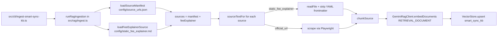
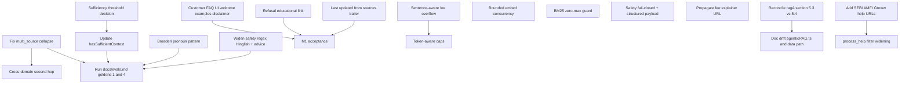

# RAG Architect Review and Implementation Roadmap

## 0. TL;DR

You have a more sophisticated RAG than the reference repo (Gemini embeddings, hybrid BM25 rerank, PII masking, pronoun rewrite, agentic-style multi-source merge, content-aware chunking, hash-skip ingestion, post-gen safety LLM). The architecture itself is sound. **The defects worth fixing are mostly inside your own pipeline, not gaps relative to the reference repo:**

- A real correctness bug in classification that silently drops the fee explainer for "exit-load + why charged" queries (eval Q1/Q4 will flag this).
- Sufficiency thresholds and pronoun pattern weaker than [docs/architecture/ragA.md](docs/architecture/ragA.md).
- Customer FAQ UI is missing M1-mandated welcome / 3 examples / facts-only note.
- Refusal message has no "educational link" as M1 requires.
- Source manifest is 14 HDFC scheme pages only — below the 15–25 floor and missing AMFI/SEBI/help pages M1 calls for.
- Wording divergence: "Last checked: YYYY-MM-DD" vs M1's "Last updated from sources: <date>".
- Answer length is "≤6 bullets" while M1 says "≤3 sentences" — choose one and align all docs.

The reference repo (`deepanjandhwani/mutualfundragchatbot`) is simpler and weaker on most axes (local MiniLM, no BM25, no fee explainer, no multi-source, stateless, no PII masking). Per your direction we will **not** restructure to mimic it; we only note three items as observations (not actions).

---

## 1. When `config/static_fee_explainer.md` is invoked

### 1.1 Ingestion path (always, on every refresh)

- Entry: `npm run phase3:ingest` (CLI) or `.github/workflows/rag_refresh.yml` (daily cron 10:00 IST).
- Frontmatter parsed in [src/rag/manifest.ts](src/rag/manifest.ts) `loadFeeExplainerSource` → `parseFeeExplainer` (lines 30–43, 118–159) → produces `SourceConfig { source_id: "fee_static_001", source_type: "static_fee_explainer", content_type: "fee_explanation", url: "https://groww.in/p/expense-ratio", last_checked, ... }`.
- Body chunked in [src/rag/chunk.ts](src/rag/chunk.ts) using fee-aware heading regex (`Exit Load`, `Expense Ratio`, `Stamp Duty`, `12B-1`, `Brokerage Fees`, etc.) with `MAX_FEE_WORDS=300`. Each chunk is stamped with `fee_type` (from `detectFeeType` on heading+text) and `scenario` (= section heading) at lines 244–247.
- Important: chunk metadata **forces `url: null` for `static_fee_explainer`** (lines 223–228), so the frontmatter URL `https://groww.in/p/expense-ratio` is **not** propagated to citation output.

### 1.2 Retrieval path (conditional, per query)

Fee chunks are surfaced **only** when the final classification (after `applyQuerySemantics`) is one of:

| Final category | What happens |
|---|---|
| `fee_explanation` | `where: { content_type: "fee_explanation" }` (+ optional `fee_type` $and) — sole filter |
| `multi_source` | `where: { $or: [scheme_fact, fee_explanation] }` for primary query, then a **second** Chroma query `where: { source_id: "fee_static_001" }` (`mergeFeeStaticChunksForMultiSource` in [src/rag/retrieve.ts](src/rag/retrieve.ts) lines 36–77) and BM25 rerun on the merged set |
| `scheme_fact` | Filter is `content_type: "scheme_fact"` only — **fee chunks are excluded** |
| `process_help` / `regulatory_education` / `greeting` / `out_of_scope` | Fee chunks not retrieved |

### 1.3 Real bug: fee explainer is silently skipped for the canonical multi-source case

`applyQuerySemantics` in [src/rag/classify.ts](src/rag/classify.ts) lines 89–96 reclassifies `multi_source` → `scheme_fact` whenever a topic is detected and a `SCHEME_SPECIFIC_TERMS` keyword matches. Confirmed by `test/rag-retrieval.test.ts` lines 9–19: "What is the exit load for the HDFC Defence Fund and why was I charged it?" classifies as `scheme_fact`, **not** `multi_source`. Result: filter is scheme-only, the secondary fee_static merge does not run, and the answer cites only the scheme page.

`docs/evals.md` Q1 and Q4 explicitly require **both** `scheme_fact` and `fee_static_001` citations for these phrasings — so this is an eval-failing correctness bug.

---

## 2. Reference repo comparison (observation only — no architecture changes per your direction)

The reference repo (`deepanjandhwani/mutualfundragchatbot`, see [ARCHITECTURE.md mirror](https://raw.githubusercontent.com/deepanjandhwani/mutualfundragchatbot/main/ARCHITECTURE.md)) is materially simpler than yours.

### 2.1 Where the reference is weaker (you already do this better)

| Concern | Reference repo | Your repo |
|---|---|---|
| Embedding model | Local MiniLM (~51.8 NDCG@10) | Gemini `gemini-embedding-001` (~66 NDCG, multilingual) |
| Hybrid retrieval | Pure cosine | Cosine + BM25 70/30 in [src/rag/bm25.ts](src/rag/bm25.ts) |
| Fee explainer | None | `fee_static_001` indexed and routed |
| PII masking | Reject only | `maskPii` redacts and continues, see [src/services/safety/pii.ts](src/services/safety/pii.ts) |
| Pronoun resolution | Stateless, none | LLM rewrite using last 4 turns |
| Multi-source / multi-hop | None | `mergeFeeStaticChunksForMultiSource` |
| Post-gen safety LLM | None | `safetyJson` |
| Hash-skip re-ingestion | Full clear-and-reinsert | Content-hash diff |
| Fund clarification | None | `needs_fund_clarification` + `applySelectedFunds` |

### 2.2 Three items worth noting (we agreed not to adopt — listed only so you have visibility)

- Per-fund retrieval pattern: when N funds are selected, ref repo queries Chroma N times and merges. Yours uses a single `$or` filter that can let top-k be dominated by 1–2 funds. Your `retrievalOptionsFor` in [src/rag/faq.ts](src/rag/faq.ts) lines 235–262 partially mitigates by scaling `nResults`/`topK` with fund count, which is a reasonable alternative.
- Parse-time semantic chunking (one chunk per parsed section per fund). Yours splits by heading regex post-scrape; the parse-time approach is more robust to scraped-HTML variation.
- Fund alias expansion before retrieval. Yours handles aliases inside classification (`aliasesForSchemeName`, `distinctiveTokenMatch`) instead of as a query-rewrite step.

We will not act on these.

---

## 3. Findings vs `docs/` and the M1 brief

### 3.1 M1 brief — [.cursor/plans/M1.md](.cursor/plans/M1.md) acceptance vs current state

| M1 acceptance check | Status | Evidence |
|---|---|---|
| One product chosen | OK | Groww (ADR-018, problemStatement.md 1283) |
| 3–5 schemes under one AMC | DEVIATES | 14 HDFC schemes in `config/source_urls.json`. Project upgraded scope deliberately, but the M1 brief literally says 3–5. |
| 15–25 public pages from AMC + SEBI + AMFI | NOT MET | 14 entries, all `scheme_fact`, all Groww. No AMFI, no SEBI, no scheme FAQs, no riskometer/benchmark notes, no statement/tax-doc guides. The static fee explainer counts as 1 internal source. |
| Facts-only Q&A | OK | Implemented |
| One citation per answer | OK | `hasRequiredCitations` in `src/rag/citations.ts` |
| Refuse opinionated questions with educational link | NOT MET | `SAFETY_REFUSAL` in [src/rag/safety.ts](src/rag/safety.ts) line 4 has no educational link |
| Tiny UI: welcome line + 3 examples + "Facts-only. No investment advice." | NOT MET | [src/ui/SmartSyncFaqClient.tsx](src/ui/SmartSyncFaqClient.tsx) has welcome but no examples, no facts-only badge |
| ≤3 sentences | DEVIATES | Prompt in `answerPrompt` says "max 6 bullets" — internal docs match the 6-bullet rule but M1 says ≤3 sentences. Decide and align. |
| "Last updated from sources: <date>" | DEVIATES | Code uses "Last checked: YYYY-MM-DD" everywhere |
| No PII | OK | `maskPii` + `containsPii` |
| No performance claims / no compute returns | PARTIAL | The `returns` topic is allowed in `detectTopic` (`classify.ts` 281). Stated values from chunks are fine; ensure prompt forbids derivation. |

### 3.2 [docs/architecture/ragA.md](docs/architecture/ragA.md) — implementation gaps

| Spec | Implementation | Severity |
|---|---|---|
| Sufficiency: top ≥ 0.4 + at least one ≥ 0.5 (§5.4) — but §5.3 pseudocode says max < 0.3. Spec is internally inconsistent. | `hasSufficientContext` uses any candidate ≥ 0.3 ([src/rag/retrieve.ts](src/rag/retrieve.ts) line 12). | High |
| Pronoun pattern includes `above`, `previous`, `same` (§4.2 Step 0) | `PRONOUN_PATTERN` in [src/rag/faq.ts](src/rag/faq.ts) line 10 omits `above`, `previous` | Medium |
| Three discrete agentic tools `search_scheme_facts`, `search_fee_explainer`, `search_process_help` (§5.1–5.2) | Inlined in `faq.ts` + `retrieve.ts`; no `agenticRAG.ts` file (the spec §8.2 references it as if it exists) | Medium (doc drift + behavioral) |
| Cross-domain second hop when scheme_fact / fee_explanation is insufficient (§5.3 pseudocode "secondary tool if needed") | Not implemented; only `multi_source` triggers a second pass | Medium |
| `process_help` should search `help_page` OR `regulatory_education` (§5.1 tool 3 description) | `buildMetadataFilter` for `process_help` returns `help_page` only ([src/rag/classify.ts](src/rag/classify.ts) line 144) | Medium (latent — manifest has neither yet) |
| Token-based chunk caps (§2.2) | Word-count proxy (`MAX_SCHEME_WORDS=400`, `MAX_FEE_WORDS=300`) in `src/rag/chunk.ts` | Low–Medium |
| Fee overflow at sentence boundary (§2.2) | `splitLongParagraph` does fixed-width word windows | Low–Medium |
| Help-page step-aware splitting (§2.2) | Not implemented (manifest has no help pages yet) | Latent |
| `agenticRAG.ts` and `data/static_fee_explainer.md` referenced (§8.2–8.3) | Code lives in `faq.ts`; file is at `config/static_fee_explainer.md` | Doc drift |

### 3.3 Bug list affecting evals

- **multi_source collapse to scheme_fact** — described in §1.3 above. Eval Q1, Q4 in [docs/evals.md](docs/evals.md) require dual citation (scheme + `fee_static_001`).
- **Fee explainer URL dropped** — [src/rag/chunk.ts](src/rag/chunk.ts) lines 223–228 force `url: null` for `static_fee_explainer`. Citations therefore can never link to the source URL `https://groww.in/p/expense-ratio` even though the frontmatter has it. Acceptable per current rules (`url: null` is allowed for fee explainer per `rules.md`), but if you want clickable fee citations, change this.
- **Safety LLM fails open** — [src/rag/answer.ts](src/rag/answer.ts) lines 113–130 catches all errors and returns `true`. If the safety LLM 5xx's the unsafe answer goes through. Spec §7.3 wants structured `failed_checks` array and includes `user_query` + `citations`; current prompt sends only the answer text.
- **`shouldRefuseQuery` patterns gap (already partly addressed)** — pre-retrieval refusal patterns recently widened to catch "Can I invest..." (per the prior turn), but consider: "Tell me which fund to pick", "What's a safe fund for me", Hinglish ("kaunsa fund le sakta hu"), "iss fund mein invest kar sakte hai".

### 3.4 Eval coverage status

[docs/evals.md](docs/evals.md) defines:
- 5 golden retrieval Qs (no aggregate threshold; per-Q faithfulness/relevance/citation/no-advice).
- 4 adversarial Qs — required pass rate **100%** (4/4).
- 3 PII masking tests — required pass rate **100%** (3/3).
- UX checklist for FAQ slice (pronoun rewrite, fallback, last 3 turns, fund filter, `selected_funds`, SQLite persistence).

A `scripts/run-phase3-evals.ts` exists in the working tree (per git status) but should be verified to actually exercise these gates and emit a pass/fail report.

---

## 4. Internal RAG improvements (chunking, embedding, retrieval) — within current architecture

Listed by ROI; high-impact first.

- **Chunking — header detection robustness.** `splitByKnownSectionHeadings` in [src/rag/chunk.ts](src/rag/chunk.ts) relies on a regex of known scheme/fee headings. Add: (1) a fallback for missing headings that splits on `\n\n` paragraph boundaries with a 250–400 word target; (2) normalize whitespace and unicode bullets first; (3) sentence-aware overflow for `fee_explanation` (use a simple `[.!?]\s` regex with abbreviation safelist) instead of fixed word windows.
- **Chunking — token-accurate caps.** Replace word counts with a cheap token proxy (e.g., 1.3 × word count rule of thumb, or `cl100k_base` via `tiktoken`-equivalent). Aligns with spec §2.2 and prevents under-/over-shoot when chunks contain numbers/symbols.
- **Embedding — keep per-doc stagger, add bounded concurrency.** [src/rag/gemini.ts](src/rag/gemini.ts) lines 43–53 embed sequentially with `RAG_EMBED_STAGGER_MS=120ms`. For ~400 chunks that's ~48s; you can run 3–4 in flight with a token-bucket limiter and still respect 1500 RPM.
- **Retrieval — fix sufficiency thresholds.** Decide between spec §5.3 (`< 0.3 → no_results`) vs §5.4 (`top ≥ 0.4 AND any ≥ 0.5`) and update [src/rag/retrieve.ts](src/rag/retrieve.ts) `MIN_RELEVANCE_SCORE`. Then update `docs/architecture/ragA.md` to remove the inconsistency.
- **Retrieval — broaden pronoun pattern.** Add `above`, `previous`, `earlier`, `last`, `before` to `PRONOUN_PATTERN` in [src/rag/faq.ts](src/rag/faq.ts).
- **Retrieval — multi_source preservation rule.** Stop collapsing `multi_source` → `scheme_fact` in `applyQuerySemantics` ([src/rag/classify.ts](src/rag/classify.ts) lines 89–96) when the query contains `(why|charged)` co-occurring with a fee term. Add an explicit guard so multi-source survives.
- **Retrieval — cross-domain second hop.** Implement spec §5.3: when a scheme_fact retrieval has insufficient context, do one secondary `search_fee_explainer`, and vice versa. Keep the 2-call hard cap.
- **Retrieval — `process_help` filter widening.** Expand `buildMetadataFilter` for `process_help` to `$or [help_page, regulatory_education]` per spec §5.1 tool 3.
- **BM25 — guard for empty corpus.** Per [docs/edgeCase.md](docs/edgeCase.md) lines 33–35, when BM25 score normalization is degenerate (all scores 0 or single candidate), fall back to cosine ordering. [src/rag/bm25.ts](src/rag/bm25.ts) divides by `maxScore`; if `maxScore === 0` the result is `NaN`. Add guard.
- **Safety — close fail-open.** In [src/rag/answer.ts](src/rag/answer.ts) `answerPassesSafety`, on `safetyJson` error, return `false` and surface a refusal rather than `true`. Add structured prompt with `user_query` + `citations` payload per spec §7.3, and parse `failed_checks` array.
- **Citations — propagate fee URL.** Drop the `url: null` force in [src/rag/chunk.ts](src/rag/chunk.ts) lines 223–228 for `static_fee_explainer` if `frontmatter.url` is set; let the renderer link to `https://groww.in/p/expense-ratio` per `rules.md` "URL where claims rely on official content".

---

## 5. M1 brief alignment fixes

- **UI** ([src/ui/SmartSyncFaqClient.tsx](src/ui/SmartSyncFaqClient.tsx) and `UnifiedCustomerAssistantClient.tsx`): add a welcome line, 3 example chips ("Expense ratio of HDFC Defence Fund?", "ELSS lock-in?", "How to download capital-gains statement?"), and a small "Facts-only. No investment advice." note.
- **Refusal text** ([src/rag/safety.ts](src/rag/safety.ts) line 4): append a SEBI educational link, e.g., `https://investor.sebi.gov.in/`. Match the wording in `rules.md` lines 34–38 once that doc is updated.
- **"Last updated from sources" wording**: choose one (M1 says "Last updated from sources: <date>"; code uses "Last checked: YYYY-MM-DD"). If you want to keep "Last checked" inside the citation bullets, add a single trailer line in the answer prompt: `"Last updated from sources: <max(last_checked) of cited chunks>"`.
- **Answer length policy**: pick "≤6 bullets" or "≤3 sentences". Update both `answerPrompt` in `src/rag/answer.ts` lines 90–104 and the doc that disagrees. Recommended: keep "≤6 bullets" (matches `rules.md` and `problemStatement.md` 560–571), and update M1.md to reflect the upgrade.
- **Manifest**: add SEBI/AMFI educational pages (riskometer explainer, ELSS lock-in, exit load definition, capital gains statement guide) and at least one Groww help page, to push to ≥15 sources and to populate `regulatory_education` and `help_page` content types. Ensures `process_help`/`regulatory_education` retrieval branches actually have data.

---

## 6. Doc / consistency cleanups

- Reconcile sufficiency thresholds in [docs/architecture/ragA.md](docs/architecture/ragA.md) §5.3 vs §5.4.
- §8.2 references `agenticRAG.ts` and `embed.ts`; update to actual files (`faq.ts`, `gemini.ts`).
- §8.3 references `data/static_fee_explainer.md`; canonical path is `config/static_fee_explainer.md`.
- [docs/problemStatement.md](docs/problemStatement.md) §13.4 says "Maximum 5 themes" and "Exactly 3 top themes" — pick one.
- Verify [.cursor/rules/capstone-project-rules.mdc](.cursor/rules/capstone-project-rules.mdc) (modified per git status) hasn't drifted from `docs/rules.md`.

---

## 7. Phased implementation roadmap

The TODO list below maps each item to ranked todos. Phase A is a small, high-ROI set that fixes correctness + M1 acceptance and unblocks evals. Phase B is internal RAG quality improvements. Phase C is doc cleanup. Phase D is corpus expansion.

### Diagram of fix dependencies

### Eval gate after Phase A

After Phase A is implemented, run `scripts/run-phase3-evals.ts` and require:
- Goldens 1 and 4 produce both `scheme_fact` and `fee_static_001` citations.
- 4/4 red-team refusals.
- 3/3 PII masks.
- Pronoun-followup (Q3, Q5) passes with rewritten query containing the explicit scheme name.

