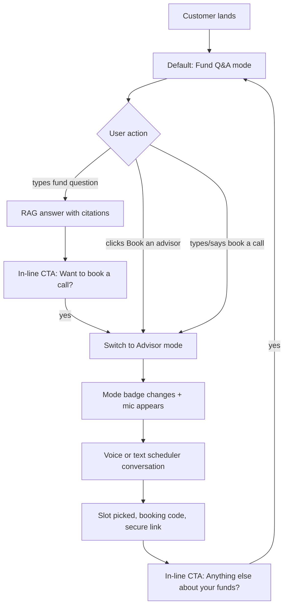

# Unified Surface — FAQ Chat + Voice-Enabled Advisor

## Design Premise

Two skills share one surface. Voice is bound to the advisor flow only because:

- FAQ answers are tabular/cited — bad fit for free-tier TTS reading aloud
- Advisor flow is conversational and short-form — perfect for voice
- The `evals.md` Section 6 voice intent checklist applies only to the scheduler

Per `docs/problemStatement.md` §6 (customer view = FAQ + Scheduler), `§10.1` (chat + voice scheduler), and `docs/decisions.md` ADR-004 (Web Speech API as free fallback).

## How "Unified" Is Preserved

Six things stay constant across both modes — that's the unification:

- One chat thread (FAQ answers and scheduler messages share the same scroll)
- One composer at the bottom (text input + send button always present)
- One sidebar on the left (advisor card stays visible always)
- One context pill area (active fund pill + active mode pill)
- Same color scheme, typography, message bubbles
- Same history drawer, same new-chat button, same readonly mode

Only **two things change** between modes:

- Mic button: hidden in FAQ mode, visible in advisor mode
- Mode badge near composer: "Fund Q&A" vs "Advisor booking — voice available"

## Three User Flows



### Flow A: Pure FAQ
1. User types fund question
2. Cited answer appears
3. After answer: "Want to talk to an advisor about this?" CTA (existing handoff system)

### Flow B: Direct advisor
1. User clicks "Book an advisor" sidebar OR types "book a call"
2. Mode badge switches to "Advisor — voice available"
3. Mic button slides into composer
4. Optional one-time toast: "Tap the mic to speak your replies"
5. Conversation proceeds

### Flow C: Mid-FAQ handoff
1. User asks fund question -> answer
2. User: "OK book me a call about exit load"
3. Existing intent router detects scheduler intent -> mode flips
4. Mic appears, conversation continues

## Concrete UI Changes in [src/ui/UnifiedCustomerAssistantClient.tsx](src/ui/UnifiedCustomerAssistantClient.tsx)

### Change 1: Invert mic visibility logic

Currently the mic is visible always but disabled when `activeScheduler` is true (line 826-837). Flip it:

```tsx
{voice.supported && activeScheduler ? (
  <button
    className={`secondary faq-mic-button${voice.listening ? " faq-mic-button--listening" : ""}`}
    aria-label={voice.listening ? "Stop voice input" : "Start voice input"}
    onClick={voice.toggle}
    disabled={loading || viewingReadonly}
  >
    <MicIcon />
  </button>
) : null}
```

Mic is hidden in FAQ mode entirely — no greyed button to confuse users.

### Change 2: Add mode badge near composer

Above the search row, show a small badge that names the current mode:

- Default: "Fund Q&A"
- When `activeScheduler`: "Advisor booking — voice available"
- When `viewingReadonly`: "Read-only past chat" (existing pattern)

This replaces the current `faq-search-disabled-hint` paragraph with something more visible and informative.

### Change 3: Update placeholder copy and onboarding

- FAQ mode placeholder: "Ask about a fund or type 'book a call'..." (signals both routes)
- Advisor mode placeholder: "Type your reply or tap the mic..."
- Welcome message updated to mention both routes explicitly

### Change 4: Add lightweight TTS for advisor responses

Use browser `SpeechSynthesis` API (zero cost, no install) to speak short scheduler responses **only when the user used voice for input**. Skip TTS for text-typed inputs even in advisor mode.

```tsx
function speakIfVoiceMode(text: string) {
  if (!lastInputWasVoice || !window.speechSynthesis) return;
  const utterance = new SpeechSynthesisUtterance(condense(text, 200));
  utterance.lang = "en-IN";
  window.speechSynthesis.speak(utterance);
}
```

Track `lastInputWasVoice` as a ref toggled inside `useSpeechToText`'s onresult handler. Only speak the first ~200 chars or first sentence to avoid robot-voice fatigue.

### Change 5: Sidebar treatment unchanged but enhanced

Keep the existing left "Book an advisor" card. Add a small "Voice available" indicator below the buttons so users know voice exists before entering. Per `edgeCase.md`, also surface a fallback message if `voice.supported === false`.

## CSS Additions in [app/globals.css](app/globals.css)

- `.assistant-mode-badge` — small pill above the composer, color-shifts between FAQ and advisor modes
- `.assistant-mode-badge--advisor` — accent color highlighting voice availability
- `.assistant-mode-toast` — one-time toast that fades after 5s when entering advisor mode
- `.assistant-voice-indicator` — small "voice available" line in the sidebar card

No layout-shifting changes — composer stays put, mic just appears/disappears in its slot.

## What Is NOT in This Plan (Separate Work)

- Pre-computed `fund_facts` table for comparisons (separate plan)
- Levenshtein typo tolerance for fund name matching (separate plan)
- Deepgram STT integration per ADR-004 (separate plan — Web Speech API is sufficient for advisor flow as fallback per `edgeCase.md`)
- Returns-comparison refusal hardening (separate plan)

This plan is intentionally narrow: rewire visibility, add mode badge, plug in basic TTS for spoken replies. ~150 lines of changes across 2 files.

## Files Touched

- [src/ui/UnifiedCustomerAssistantClient.tsx](src/ui/UnifiedCustomerAssistantClient.tsx) — mic visibility, mode badge, TTS hook, placeholder copy, welcome message
- [app/globals.css](app/globals.css) — mode badge styles, sidebar voice indicator

## Acceptance Checks (from existing eval criteria)

- `evals.md` §6 #6: voice flow uses the same backend state machine as chat — already true via `routeMessage`
- `evals.md` §6 #5: silent-mid-flow timeout — Web Speech API auto-stops after silence; surface a "still there?" prompt if needed
- `edgeCase.md` voice section: graceful fallback if mic denied or unsupported — already handled by `voice.supported`
- `problemStatement.md` §10.1: chat and voice share state machine — already true
