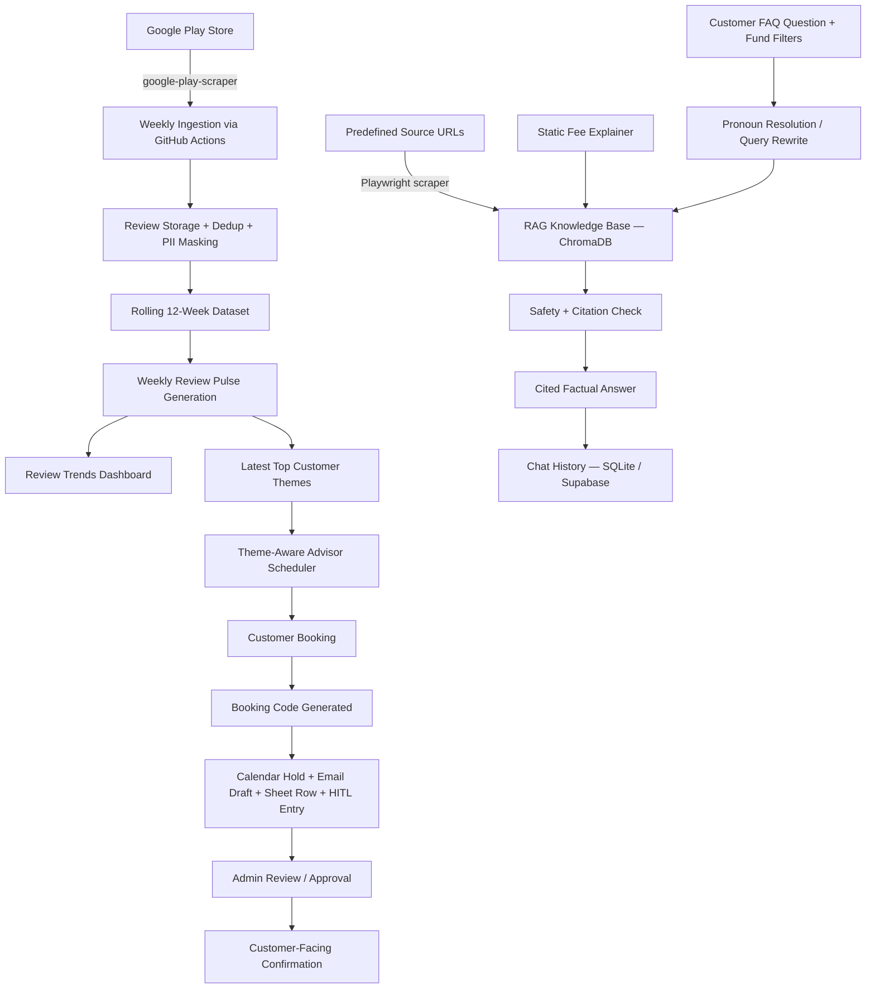
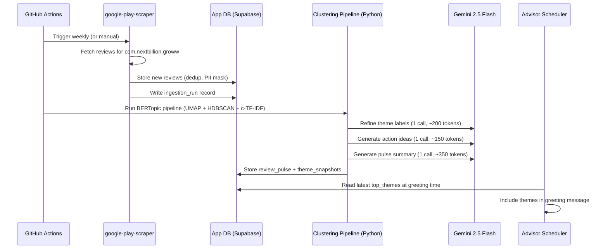
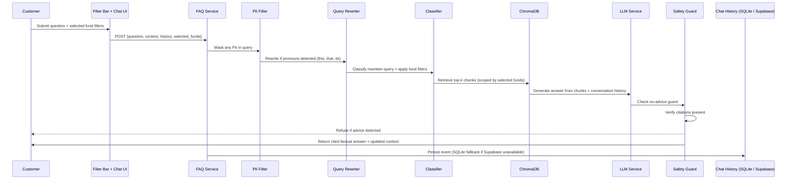
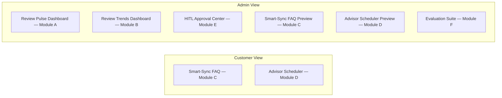

# Architecture — Investor Ops & Intelligence Suite

## 1. System Overview

The Investor Ops & Intelligence Suite is a unified AI-powered web application for Groww that connects Google Play Store review intelligence, facts-only customer FAQ support, chat and voice advisor scheduling, and human-in-the-loop operations management. Customers get factual mutual fund answers from predefined official sources and book tentative advisor appointments without sharing personal information. Admin users ingest and monitor Google Play reviews weekly via GitHub Actions, view rolling 12-week review trends, manage advisor booking operations through synced Google Sheet and HITL records, and verify system reliability through structured evaluations. Services run on free-tier infrastructure, local sidecars, or explicitly flagged credit-limited free credits.

### User Roles

- **Customer** — retail user who asks factual questions (Smart-Sync FAQ) and books advisor slots (Advisor Scheduler). Cannot see admin modules.
- **Admin** — internal product, support, ops, compliance, or advisor team member who monitors review intelligence, manages bookings, approves customer-facing actions, and runs evaluations.

### Core System Flow



---

## 2. Module Map

### Module A — Automated Google Play Review Intelligence

- **Inputs:** Google Play Store reviews for `com.nextbillion.groww` via `google-play-scraper`
- **Outputs:** Stored reviews (deduplicated, PII-masked), weekly Review Pulse (top themes, overall representative quotes, action ideas, summary), latest top customer themes
- **Integrations:** GitHub Actions (scheduled weekly trigger), App DB (review + pulse storage)
- **Access:** Admin only (ingestion health dashboard, pulse view, manual trigger button)

### Module B — Review Trends Dashboard

- **Inputs:** Stored weekly Review Pulse records from App DB
- **Outputs:** Week-over-week trend metrics (volume, rating, sentiment, theme share, emerging/worsening/improving themes)
- **Integrations:** App DB (reads review_pulse, reviews)
- **Access:** Admin only

### Module C — Smart-Sync Knowledge Base (FAQ)

- **Inputs:** Customer question (text), conversation history (last 4 turns for pronoun resolution), selected fund filters (fund type, risk profile, fund names), ~15 predefined official URLs (scraped via Playwright), static fee explainer text
- **Outputs:** Facts-only answer with source citations and last-checked date, max 6 bullets, updated session context (active_fund, last_topic, recent_funds)
- **Key features:**
  - LLM-powered query rewriting resolves pronouns ("this fund", "its", "that") before embedding and classification (See ADR-020)
  - Always-visible fund filter bar (Fund Type / Risk Profile / Fund Name) scopes retrieval to selected funds (See ADR-021)
  - Conversation history injected into answer prompt for contextual coherence
  - Chat history persisted to SQLite locally (Supabase when available) (See ADR-019)
- **Integrations:** ChromaDB (vector retrieval), LLM (query rewrite + answer generation + safety check), GitHub Actions daily RAG refresh at 10:00 AM IST
- **Access:** Customer (interactive FAQ), Admin (FAQ preview)

### Module D — Chat + Voice Advisor Scheduler

- **Inputs:** Customer message or voice input, latest top themes from Module A, advisor calendar availability
- **Outputs:** Tentative booking code, secure details link, advisor calendar hold, Google Sheet row, advisor email draft, HITL record
- **Integrations:** Google Calendar via FastMCP, Google Sheets via FastMCP, Gmail via FastMCP, Deepgram (STT for voice — See ADR-004), App DB
- **Access:** Customer (chat + voice booking), Admin (scheduler preview)

### Module E — Human-in-the-Loop Approval Center

- **Inputs:** Booking records, advisor calendar hold status, advisor email draft status, Google Sheet `approval_status`
- **Outputs:** Approved/rejected/rescheduled/cancelled customer-facing actions, synced HITL + Sheet statuses
- **Integrations:** Google Calendar via FastMCP, Google Sheets via FastMCP, Gmail via FastMCP, App DB
- **Access:** Admin only

### Module F — Evaluation Suite

- **Inputs:** Golden dataset (5 retrieval questions, 3+ adversarial prompts), live system state
- **Outputs:** Evaluation report covering retrieval accuracy, safety pass/fail, UX structure checks, integration checks, sync checks
- **Integrations:** All modules (reads outputs for verification)
- **Access:** Admin only

---

## 3. Data Flow

### 3.1 Reviews → Storage → Pulse → Scheduler Greeting



### 3.2 Booking → Code → Calendar + Sheet + Email + HITL

```mermaid
sequenceDiagram
    participant Cust as Customer
    participant Sched as Scheduler Service
    participant Web as Secure Details API
    participant DB as App DB
    participant Cal as Google Calendar (FastMCP)
    participant Sheet as Google Sheets (FastMCP)
    participant Mail as Gmail (FastMCP)
    participant Admin as Admin (HITL)

    Cust->>Sched: Book / Reschedule / Cancel
    Sched->>Sched: Classify intent, collect topic + slot
    Sched->>DB: Save booking with generated code (e.g. NL-A742)
    Sched->>Cal: Read availability, then create advisor calendar hold (immediate)
    Sched->>Sheet: Create Google Sheet row (immediate)
    Sched->>Mail: Create template advisor email draft (immediate, never auto-sent)
    Sched->>DB: Create HITL record (HITL status: pending; booking status: pending_admin_confirmation)
    Sched->>Cust: Return tentative booking code + secure details link
    Cust->>Web: Submit secure details via opaque-token link (outside AI conversation)
    Web->>DB: Store token hash + encrypted secure details outside chat transcript
    Admin->>DB: Review booking in HITL Center
    Admin->>DB: Approve / Reject / Reschedule / Cancel
    DB->>Sheet: Sync status update
    DB->>Cal: Add customer attendee only if approved + secure details submitted
```

### 3.3 FAQ Question → Query Rewrite → RAG → Safety Check → Cited Answer



---

## 4. Integration Map

### Google Calendar — via FastMCP (See ADR-008)

- **Trigger:** Booking conversation ends (new booking, reschedule, cancel)
- **Reads:** Advisor availability before slot presentation.
- **Writes:** Advisor calendar hold event with title format `Advisor Q&A — {topic} — {booking_code}`, start/end time in IST, advisor email as organizer, `customer_attendee_added: false`
- **Timing:** Immediate after booking (advisor-side hold). Customer attendee added only after secure details submission + Admin approval (approval-gated).

### Google Sheets — via FastMCP (See ADR-008)

- **Trigger:** Booking conversation ends; Admin status change in HITL
- **Writes:** Row with date, product, topic, slot, booking_code, weekly_pulse_themes, source, approval_status, advisor_calendar_status, advisor_email_draft_status
- **Timing:** Row creation is immediate. Status updates are immediate on every HITL status change. HITL and Sheet must always be in sync (See rules.md Sync Rules).

### Gmail — via FastMCP (See ADR-008)

- **Trigger:** Booking conversation ends; reschedule approved
- **Writes:** Template draft email (never auto-sent) with booking code, product, topic, slot, no-PII statement, secure link note, market/product context read from latest Review Pulse
- **Timing:** Draft creation is immediate. Sending is never automated — Admin reviews draft externally. (See ADR-005)

### GitHub Actions

- **Trigger:** Cron schedule (weekly); manual dispatch from Admin dashboard
- **Writes:** Calls `google-play-scraper`, writes reviews + ingestion_run to App DB, triggers Review Pulse generation
- **Timing:** Immediate (scheduled). No approval gate — ingestion is fully automated.

---

## 5. Database Schema

### 5.1 App DB — Supabase Free Tier (Postgres) (See ADR-011)

All Phase 1 `public` tables have RLS enabled. Until role-specific access policies are implemented in later phases, `anon` and `authenticated` roles are explicitly denied; backend services use server-side credentials only.

**`reviews`**

| Column | Type | Notes |
|---|---|---|
| id | UUID / INTEGER | Primary key |
| review_id | TEXT | External ID from Google Play (dedup key) |
| review_text | TEXT | PII-masked with `[REDACTED]` |
| rating | INTEGER | 1-5 |
| review_date | TIMESTAMP | Original review date |
| source | TEXT | `google_play` |
| ingestion_run_id | FK | References ingestion_runs.id |
| created_at | TIMESTAMP | Ingestion timestamp |

**`ingestion_runs`**

| Column | Type | Notes |
|---|---|---|
| id | UUID / INTEGER | Primary key |
| run_time | TIMESTAMP | When the run executed |
| status | TEXT | `success` / `partial_success` / `failed` |
| reviews_fetched | INTEGER | Total fetched from source |
| reviews_stored | INTEGER | New reviews stored |
| reviews_skipped | INTEGER | Duplicates skipped |
| reviews_failed | INTEGER | Rejected or errored |
| error_message | TEXT | Nullable |
| review_window_start | DATE | Earliest review date covered |
| review_window_end | DATE | Latest review date covered |
| next_scheduled_run | TIMESTAMP | Computed next run time |

**`review_pulse`**

| Column | Type | Notes |
|---|---|---|
| id | UUID / INTEGER | Primary key |
| product | TEXT | Always `Groww` |
| period | TEXT | e.g. `Rolling 12 weeks ending 2026-04-26` |
| total_reviews_analyzed | INTEGER | |
| average_rating | REAL | |
| top_themes | JSON | Exactly 5 items: `{theme, rank}` |
| representative_quotes | JSON | Exactly 3 overall representative customer quotes |
| weekly_summary | TEXT | Max 250 words |
| action_ideas | JSON | Exactly 3 objects: `{idea, based_on_theme, evidence}` grounded in top themes |
| top_customer_themes | JSON | Used by Scheduler greeting |
| source | TEXT | Always `Google Play Store Reviews` |
| created_at | TIMESTAMP | Generation time |

**`bookings`**

| Column | Type | Notes |
|---|---|---|
| id | UUID / INTEGER | Primary key |
| booking_code | TEXT | Format `LL-LDDD` (2 letters + hyphen + 1 letter + 3 digits, e.g. `NL-A742`), unique |
| topic | TEXT | e.g. `Account Changes / Nominee` |
| slot_start | TIMESTAMP | IST |
| slot_end | TIMESTAMP | IST |
| status | TEXT | Customer-facing booking lifecycle: `pending_admin_confirmation` / `confirmed` / `reschedule_requested` / `rescheduled` / `cancel_requested` / `cancelled` / `rejected` |
| input_mode | TEXT | `chat` / `voice` |
| secure_link_submitted | BOOLEAN | Default false |
| secure_details_token_hash | TEXT | Hash of opaque secure-details token; raw token is never stored |
| secure_link_expires_at | TIMESTAMP | Expiry for the secure details link |
| calendar_event_id | TEXT | From Google Calendar API |
| sheet_row_id | TEXT | From Google Sheets API |
| email_draft_id | TEXT | From Gmail API |
| calendar_status | TEXT | `created` / `updated` / `cancelled` / `failed` |
| sheet_status | TEXT | `created` / `updated` / `cancelled` / `failed` |
| email_draft_status | TEXT | `created` / `updated` / `failed` |
| created_at | TIMESTAMP | |
| updated_at | TIMESTAMP | |

**`secure_details_submissions`**

| Column | Type | Notes |
|---|---|---|
| id | UUID / INTEGER | Primary key |
| booking_id | FK | References bookings.id, unique |
| booking_code | TEXT | Denormalized for display and lookup |
| token_hash | TEXT | Hash of opaque secure-details token |
| details_ciphertext | TEXT | Encrypted secure-details payload; raw details are never stored in AI chat/voice transcripts |
| details_metadata | JSON | Non-sensitive metadata for audit/debugging |
| expires_at | TIMESTAMP | Secure link expiry |
| submitted_at | TIMESTAMP | Submission time |
| created_at | TIMESTAMP | |

**`hitl_actions`**

| Column | Type | Notes |
|---|---|---|
| id | UUID / INTEGER | Primary key |
| booking_id | FK | References bookings.id |
| booking_code | TEXT | Denormalized for display |
| action_type | TEXT | `confirm` / `reschedule` / `cancel` / `reject` |
| status | TEXT | HITL decision lifecycle: `pending` / `approved` / `rejected` / `executed` / `failed` |
| target_booking_status | TEXT | Booking status to apply when the action is executed |
| payload | JSON | Full action payload for Admin preview/edit, including booking_code and integration retry state |
| source_module | TEXT | `advisor_scheduler` |
| admin_notes | TEXT | Nullable |
| calendar_status | TEXT | Mirrors bookings.calendar_status |
| sheet_status | TEXT | Mirrors bookings.sheet_status |
| email_draft_status | TEXT | Mirrors bookings.email_draft_status |
| created_at | TIMESTAMP | |
| updated_at | TIMESTAMP | |

**`review_embeddings`**

| Column | Type | Notes |
|---|---|---|
| id | UUID / INTEGER | Primary key |
| review_id | FK | References reviews.id, unique |
| embedding | JSON | 768-dim vector as JSON array |
| model | TEXT | `"gemini-embedding-001"` |
| created_at | TIMESTAMP | Embedding generation time |

**`theme_snapshots`**

| Column | Type | Notes |
|---|---|---|
| id | UUID / INTEGER | Primary key |
| pulse_id | FK | References review_pulse.id |
| theme_name | TEXT | Canonical theme label |
| theme_type | TEXT | `"predefined"` / `"emergent"` |
| review_count | INTEGER | Reviews in this cluster |
| theme_share_percent | REAL | Percentage of total reviews |
| keywords | JSON | c-TF-IDF top keywords |
| trend_status | TEXT | `"worsening"` / `"improving"` / `"stable"` / `"emerging"` |
| wow_change_percent | REAL | Nullable (null for emerging) |
| week_start | DATE | Start of the week covered |
| week_end | DATE | End of the week covered |
| created_at | TIMESTAMP | Snapshot creation time |

### 5.1.1 Chat History — SQLite Fallback (See ADR-019)

When Supabase credentials are not configured, chat history is persisted to a local SQLite database at `.data/chat-history.sqlite` using `better-sqlite3`. The schema mirrors the Supabase `assistant_sessions` and `assistant_session_events` tables. When Supabase is available, it is preferred. The fallback is transparent — API routes always return a functioning repository.

**`assistant_sessions`** (SQLite or Supabase)

| Column | Type | Notes |
|---|---|---|
| id | TEXT (UUID) | Primary key |
| device_id_hash | TEXT | SHA-256 hash of client device UUID |
| label | TEXT | First user message (max 120 chars), nullable |
| lane_summary | JSON | `{"assistant": N, "rag": N, "scheduler": N}` |
| created_at | TEXT (ISO) | Session creation time |
| last_activity_at | TEXT (ISO) | Last event time |

**`assistant_session_events`** (SQLite or Supabase)

| Column | Type | Notes |
|---|---|---|
| id | TEXT (UUID) | Primary key |
| session_id | TEXT (UUID) | FK → assistant_sessions.id (CASCADE) |
| seq | INTEGER | Sequence number within session |
| role | TEXT | `user` / `assistant` |
| lane | TEXT | `assistant` / `rag` / `scheduler` |
| kind | TEXT | Event type (e.g., `faq_question`, `faq_answer`) |
| content | TEXT | PII-masked message text |
| pii_masked | BOOLEAN | Whether PII was detected and masked |
| pii_findings | JSON | Array of PII findings |
| citations | JSON | Nullable |
| status | TEXT | Nullable |
| created_at | TEXT (ISO) | Event time |

### 5.2 Vector DB — ChromaDB (See ADR-001, ADR-012)

ChromaDB runs locally as the selected free vector DB for the capstone demo. For a hosted deployment, it must run as an explicitly configured free sidecar service or be migrated through a new ADR. The daily Smart-Sync RAG refresh workflow runs at 10:00 AM IST (`30 4 * * *` UTC) and must use `GH_CHROMA_URL` pointing to the same reachable ChromaDB instance that serves customer FAQ queries.

**Collection: `smart_sync_kb`**

Single collection with metadata-based partitioning. Stores all chunks — scheme factsheets (~15 predefined official URLs scraped via Playwright), static fee explainer, regulatory education pages, and help pages. Chunk types are distinguished via `content_type` metadata field, not separate collections.

Metadata per document:

```json
{
  "source_id": "src_001",
  "source_type": "official_url",
  "content_type": "scheme_fact",
  "title": "Official Scheme Factsheet",
  "url": "https://official-source-url.com",
  "last_checked": "2026-04-26",
  "scheme_name": "Axis ELSS Fund",
  "fund_type": "sectoral",
  "risk_category": "Very High Risk",
  "section_type": "exit_load",
  "fee_type": null,
  "scenario": null,
  "topic": null,
  "content_hash": "sha256:...",
  "chunk_index": 0
}
```

The `fund_type` and `risk_category` fields (See ADR-021) are sourced from `config/source_urls.json` and enriched during the scraping step. The `/api/smart-sync-faq/funds` endpoint serves this catalog to the frontend filter bar.

The `content_type` field partitions the collection:

- `scheme_fact` — scheme factsheet chunks (exit load, expense ratio, lock-in, etc.)
- `fee_explanation` — static fee explainer chunks
- `regulatory_education` — AMFI/SEBI educational content
- `help_page` — process/how-to pages

Retrieval filters by `content_type` (and optional fields like `scheme_name`, `fee_type`, `topic`) using ChromaDB `where` clauses. Multi-hop queries use `$or` filters across content types in a single pass. See `docs/architecture/ragA.md` Section 3 for full collection design and query patterns.

Embedding model: Gemini gemini-embedding-001 (See ADR-002, resolved in docs/architecture/ragA.md). 768 output dimensions, free tier via Gemini API / AI Studio, no GPU required.

Distance metric: Cosine similarity.

Vector index type: See ADR-007 (resolved in docs/architecture/ragA.md).

---

## 6. Role-Based Access



| Role | Modules Visible | Modules Hidden |
|---|---|---|
| Customer | Module C (FAQ), Module D (Scheduler) | Modules A, B, E, F |
| Admin | Modules A, B, C (preview), D (preview), E, F | None |

Admin-only modules (A, B, E, F) must never be accessible or visible to Customer users. The UI uses role-aware navigation to enforce this boundary.

---

## 7. Safety and Compliance Layer

### No-PII Enforcement

| Checkpoint | Location | Behavior |
|---|---|---|
| Review ingestion | Module A — after scraping | Mask PII with `[REDACTED]` before storage |
| FAQ query input | Module C — before embedding lookup | Strip/mask any PII in user query |
| Scheduler conversation | Module D — chat + voice input | Never ask for PAN, Aadhaar, phone, email, account number, OTP, full name, address. Provide secure link instead. |
| Voice transcription | Module D — after Deepgram STT | Mask spoken PII immediately before processing |
| Review Pulse output | Module A — pulse generation | Ensure quoted reviews are already PII-masked |
| Eval outputs | Module F | Verify no PII leaks in any eval result |

### No-Advice Guard

| Checkpoint | Location | Behavior |
|---|---|---|
| FAQ answer generation | Module C — after LLM generates answer | Reject if output contains buy/sell/hold, fund recommendations, return predictions, portfolio advice, or performance guarantees |
| Scheduler conversation | Module D — intent classification | Refuse investment advice intents; return standard refusal message from rules.md |
| Preparation guidance | Module D — after Gemini 2.5 Flash generates what-to-prepare content | Run the same no-advice and no-PII safety guard used for scheduler responses before returning guidance |

Standard refusal message (from `rules.md`):

> "I can't provide investment advice, return predictions, or handle personal account information. I can help with facts from approved sources, such as exit load, expense ratio, lock-in, benchmark, riskometer, fee explanation, or statement download steps. For investor education, see https://investor.sebi.gov.in/."

### Citation Check

| Checkpoint | Location | Behavior |
|---|---|---|
| FAQ answer output | Module C — post-generation | Every factual claim must include `source_url` + `last_checked`. Fee answers cite `source_id: fee_static_001`. Answers without citations are rejected before returning to user. |

No runtime web search is permitted. All answers come from predefined sources only (See rules.md Citation Rules).

---

## 8. LLM Call Optimization (See ADR-009 — Gemini 2.5 Flash / Flash-Lite)

### Model-per-Task Allocation

| Task | Model | Free Limit | Notes |
|---|---|---|---|
| Intent classification | Gemini 2.5 Flash-Lite | 15 RPM, 1,000 RPD | ~80 tokens/call |
| Safety check | Gemini 2.5 Flash-Lite | 15 RPM, 1,000 RPD | ~100 tokens/call |
| Query classification (RAG) | Gemini 2.5 Flash-Lite | 15 RPM, 1,000 RPD | ~50 tokens/call |
| Query rewriting (pronoun resolution) | Gemini 2.5 Flash-Lite | 15 RPM, 1,000 RPD | ~100 tokens/call; only triggered when pronouns detected in query with conversation history (See ADR-020) |
| RAG answer generation | Gemini 2.5 Flash | 10 RPM, 500 RPD | ~500 tokens/call; includes last 3 conversation turns for contextual coherence |
| Review Pulse (label refinement) | Gemini 2.5 Flash | 10 RPM, 500 RPD | 1 call/week, ~200 tokens |
| Review Pulse (action ideas) | Gemini 2.5 Flash | 10 RPM, 500 RPD | 1 call/week, ~150 tokens |
| Review Pulse (summary) | Gemini 2.5 Flash | 10 RPM, 500 RPD | 1 call/week, ~350 tokens |
| Theme clustering | Local (BERTopic) | N/A | UMAP + HDBSCAN + c-TF-IDF, no API |
| Advisor email draft | Template + DB read (no LLM) | N/A | Reads cached Review Pulse |
| Preparation guidance | Gemini 2.5 Flash | 10 RPM, 500 RPD | 1 call per what_to_prepare intent, followed by Flash-Lite safety check |

### Cached vs Per-Request (See ADR-010)

| Output | Strategy | Regeneration Trigger |
|---|---|---|
| Review Pulse | Cached in DB | Weekly (after ingestion run) |
| Top customer themes | Cached in DB | Weekly (derived from pulse) |
| Review Trends | Cached in DB | Weekly (after pulse generation) |
| FAQ answers | Computed per request | Every customer query |
| Query rewrite | Computed per request | Only when pronouns detected + history exists |
| Intent classification | Computed per request | Every scheduler message |
| Safety checks | Computed per request | Every FAQ answer + scheduler message |
| Advisor email draft | Templated once per booking | Booking creation / reschedule |

If cached Review Pulse is stale (>7 days), trigger regeneration before serving (See edgeCase.md).

### Review Analysis Pipeline

- Theme clustering runs locally via BERTopic (UMAP + HDBSCAN + c-TF-IDF). The LLM never sees raw reviews.
- LLM calls receive theme summaries and stats (~200–350 tokens each), not raw review text.
- Total LLM calls per weekly run: exactly 3 (label refinement, action ideas, pulse summary) using Gemini 2.5 Flash.
- No per-review LLM calls.
- If free-tier rate limits are hit, queue and retry with exponential backoff (See edgeCase.md LLM Call Edge Cases).

---

## 9. Phase-Wise Development Plan

### Phase 0 — Spec Alignment and Project Scaffold

- **Modules:** None (infrastructure only)
- **Deliverables:** Resolve blocking documentation contradictions, Next.js 14 App Router scaffold, role-aware Customer/Admin shell, `.env.example` inventory, and project folders for UI, services, adapters, data models, scripts, and evals.
- **Integrations:** None
- **Complexity:** Low

### Phase 1 — Data Layer and Core Safety Utilities

- **Modules:** Shared foundation for all modules
- **Deliverables:** Supabase schema, PII masking utility, booking-code generator with collision retry, centralized LLM model config.
- **Integrations:** Supabase, Gemini model configuration
- **Complexity:** Medium

### Phase 2 — Review Ingestion and Theme Classification (Module A)

- **Modules:** Module A
- **Deliverables:** `google-play-scraper` adapter, deduped and PII-masked review storage, weekly GitHub Actions ingestion, BERTopic clustering pipeline, `review_pulse`, `theme_snapshots`, and latest top customer themes.
- **Integrations:** GitHub Actions, App DB, Gemini embeddings and three weekly Gemini 2.5 Flash generation calls
- **Complexity:** Medium

### Phase 3 — RAG + FAQ (Module C)

- **Modules:** Module C
- **Deliverables:** Approved source manifest, static fee explainer, Playwright ingestion, ChromaDB `smart_sync_kb` collection, metadata-filtered retrieval with BM25 rerank, cited answer generation, and safety checks.
- **Integrations:** ChromaDB local/sidecar, Gemini embeddings/generation, Playwright
- **Complexity:** High

### Phase 4 — Google FastMCP Integrations

- **Modules:** Integration foundation for Modules D and E
- **Deliverables:** Python FastMCP server for Google Calendar, Google Sheets, and Gmail draft tools only; TypeScript MCP client and adapters; OAuth setup documentation; partial integration failure path.
- **Integrations:** Google Calendar via FastMCP, Google Sheets via FastMCP, Gmail draft creation via FastMCP
- **Complexity:** High

### Phase 5 — Chat Scheduler and HITL Approval Center (Modules D + E)

- **Modules:** Module D, Module E
- **Deliverables:** Shared chat scheduler state machine, canonical theme-aware greeting, secure-details link flow, booking lifecycle, Calendar hold, Sheet row, Gmail draft, HITL record, approval lifecycle, and sync between booking status and Sheet `approval_status`.
- **Integrations:** FastMCP adapters from Phase 4, App DB, Gemini intent/safety/preparation guidance
- **Complexity:** High

### Phase 6 — Voice Scheduler + Scheduler Hardening (Module D)

- **Modules:** Module D
- **Deliverables:**
  - **Deterministic fixes:** STT phonetic patterns in topic matching, retry cap (MAX_STATE_RETRIES=3), cancel disambiguation in confirmation state, weekday edge case fix.
  - **LLM fallback (ADR-025):** Gemini 2.5 Flash-Lite structured output fallback for intent classification and day resolution behind existing regex parsers. Feature-flagged via `SCHEDULER_LLM_FALLBACK=true`. Typical: 0 calls. Worst case: 2 calls.
  - **Voice pipeline (ADR-024):** Deepgram STT (nova-2) + Deepgram Aura TTS (ADR-004a) via HTTP batch endpoint (`/api/scheduler/voice-turn`). Hold-to-talk UX with MediaRecorder. Voice format pipeline (formatForVoice, buildTtsText) for booking code spelling, URL replacement, markdown stripping.
  - **Fallback:** Web Speech API (STT) + Browser SpeechSynthesis (TTS) when Deepgram is unavailable or credits exhausted.
  - **Voice PII masking**, booking-code spelling, and mode switching over the shared scheduler state machine.
- **Integrations:** Deepgram (credit-limited), Web Speech API fallback, Gemini free tier (fallback only), App DB
- **Complexity:** High

### Phase 7 — Admin Dashboards and Review Trends (Modules A, B, C, D, E, F)

- **Modules:** Modules A-F
- **Deliverables:** Review Pulse dashboard, Review Trends dashboard, ingestion health, HITL Approval Center, FAQ preview, scheduler preview, Evaluation Suite UI, role-aware navigation, and integration retry UI.
- **Integrations:** App DB, FastMCP retry actions
- **Complexity:** High

### Phase 8 — Evaluation Suite and Hardening (Module F)

- **Modules:** Module F
- **Deliverables:** Retrieval, safety, PII, booking integration, sync, voice intent, cost/model, no-email-send, no-Pinecone, no-Gemini-2.0, and Deepgram fallback evals with final report.
- **Integrations:** All modules (read-only verification plus controlled integration checks)
- **Complexity:** Medium
