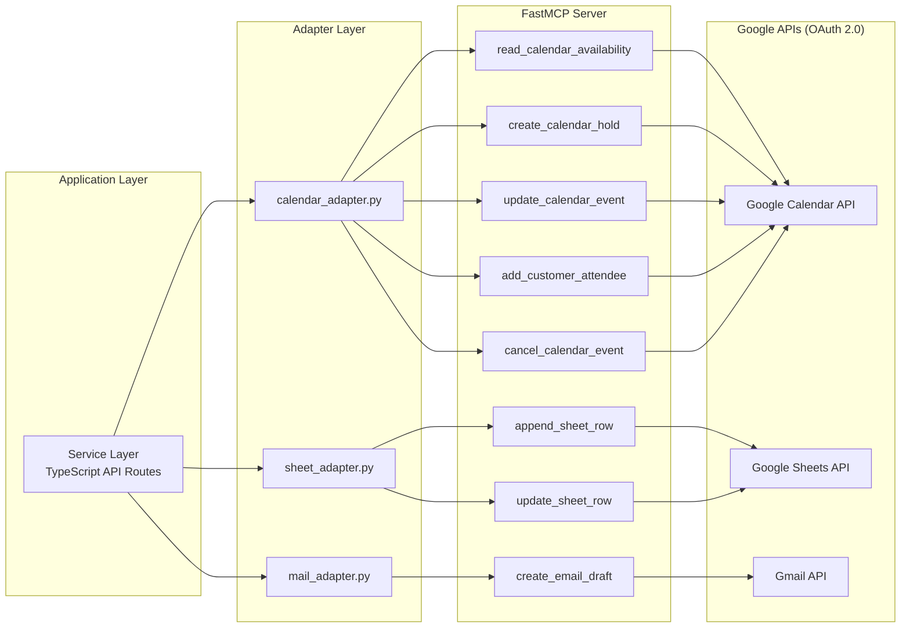
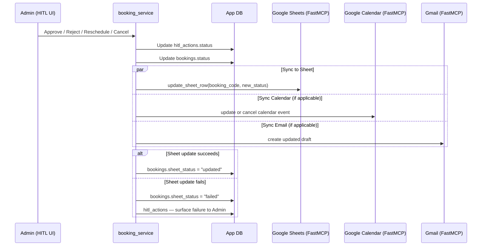
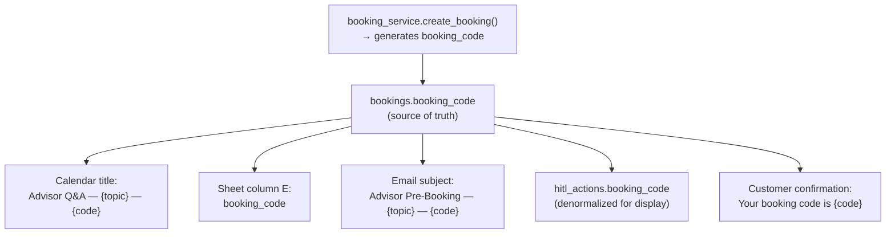
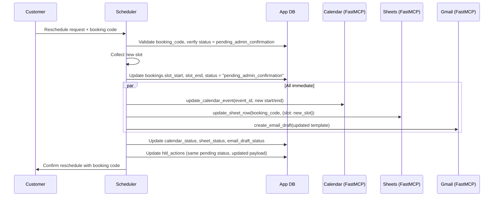
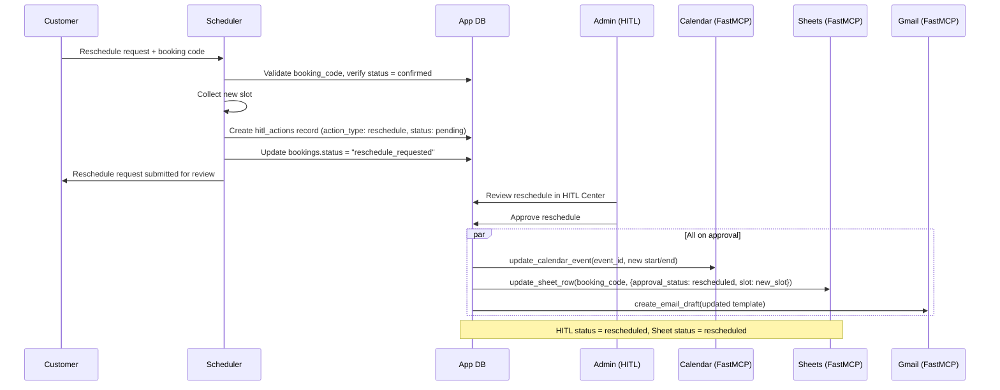
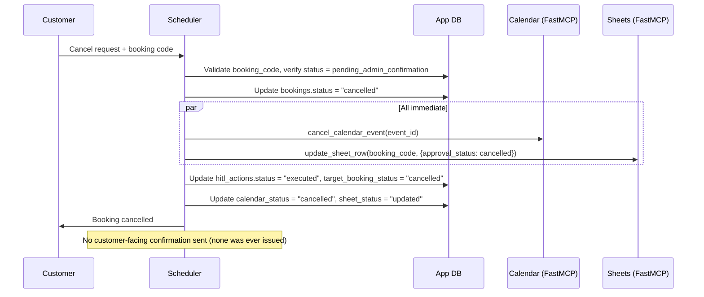
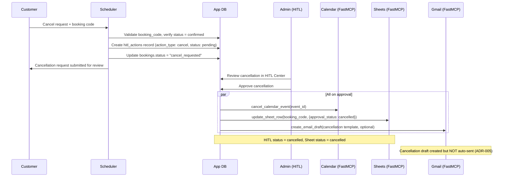
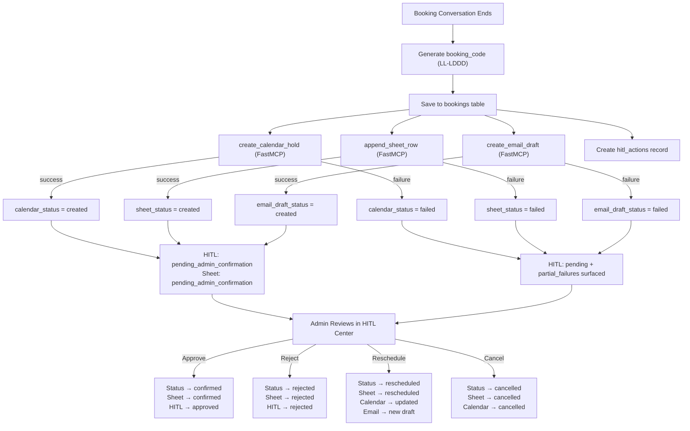

# MCP Integration Architecture — FastMCP for Google Services

> **ADR Reference:** ADR-005 (Email: draft only, never auto-send), ADR-008 (FastMCP for all Google integrations)
> **Spec Reference:** Sections 11.7, 11.8, 11.9, 12.1–12.4

---

## 1. FastMCP Setup

### 1.1 Why FastMCP

All Google service integrations use [FastMCP](https://github.com/jlowin/fastmcp), a lightweight Python framework for building Model Context Protocol servers. FastMCP exposes Google Calendar, Google Sheets, and Gmail as MCP tools that the application's service layer calls through a unified interface.

Rationale (ADR-008): Previously used by the team, simpler than raw MCP protocol, and avoids vendor lock-in to any specific Google SDK wrapper.

### 1.2 Google OAuth (Free Tier)

Google APIs are accessed via OAuth 2.0 with a free Google Cloud project. No paid APIs are used.

**OAuth Scope Mapping:**

| Service | OAuth Scope | Access Level |
|---|---|---|
| Google Calendar | `https://www.googleapis.com/auth/calendar` | Read/write advisor calendar |
| Google Sheets | `https://www.googleapis.com/auth/spreadsheets` | Read/write booking sheet |
| Gmail | `https://www.googleapis.com/auth/gmail.compose` | Create drafts only |

**Setup Flow:**

1. Create a Google Cloud project (free)
2. Enable Calendar API, Sheets API, Gmail API
3. Create OAuth 2.0 credentials (Desktop or Web application)
4. Generate `credentials.json` and complete initial consent flow to produce `token.json`
5. Store `credentials.json` path and `token.json` path in environment variables

**Required Environment Variables:**

```env
GOOGLE_CREDENTIALS_PATH=./credentials/credentials.json
GOOGLE_TOKEN_PATH=./credentials/token.json
GOOGLE_ADVISOR_CALENDAR_ID=advisor@example.com
GOOGLE_SHEET_ID=<spreadsheet-id>
GOOGLE_ADVISOR_EMAIL=advisor@example.com
```

All variables are documented in `.env.example`.

### 1.3 FastMCP Server Architecture

A single FastMCP server process exposes all three Google integrations as tools. The application's adapter layer calls these tools via the MCP client protocol.



The service layer is TypeScript (Next.js API routes). It calls the Python FastMCP server via MCP SSE transport (Section 10). The adapter layer (also TypeScript) wraps MCP client calls.

### 1.4 FastMCP Tool Registration

```python
from fastmcp import FastMCP

mcp = FastMCP("indmoney-ops-mcp")

# --- Calendar Tools ---
@mcp.tool()
def read_calendar_availability(
    advisor_calendar: str,
    window_start: str,
    window_end: str,
    timezone: str,
) -> dict:
    """Read free/busy availability before offering slots."""
    ...

@mcp.tool()
def create_calendar_hold(
    title: str,
    start_time: str,
    end_time: str,
    timezone: str,
    booking_code: str,
    advisor_calendar: str,
    description: str = "",
) -> dict:
    """Create an advisor calendar hold event. Does NOT add customer as attendee."""
    ...

@mcp.tool()
def update_calendar_event(
    event_id: str,
    title: str | None = None,
    start_time: str | None = None,
    end_time: str | None = None,
    description: str | None = None,
) -> dict:
    """Update an existing calendar event (reschedule or add details)."""
    ...

@mcp.tool()
def add_customer_attendee(
    event_id: str,
    customer_email: str,
    customer_name: str | None = None,
) -> dict:
    """Add customer attendee only after secure details submission and Admin approval."""
    ...

@mcp.tool()
def cancel_calendar_event(event_id: str) -> dict:
    """Cancel (delete) a calendar event."""
    ...

# --- Sheet Tools ---
@mcp.tool()
def append_sheet_row(
    spreadsheet_id: str,
    sheet_name: str,
    row_data: dict,
) -> dict:
    """Append a new row to the booking tracking sheet."""
    ...

@mcp.tool()
def update_sheet_row(
    spreadsheet_id: str,
    sheet_name: str,
    row_identifier: str,
    updates: dict,
) -> dict:
    """Update an existing row by booking_code lookup."""
    ...

# --- Email Tools ---
@mcp.tool()
def create_email_draft(
    to: str,
    subject: str,
    body: str,
    sender: str,
) -> dict:
    """Create a Gmail draft. NEVER sends the email."""
    ...
```

---

## 2. Google Calendar via FastMCP

### 2.1 Purpose

Read advisor availability before presenting slots, then create advisor-side calendar hold events immediately after a booking conversation ends. The customer is never added as an attendee during hold creation — `customer_attendee_added: false` at all times until secure details are submitted and Admin approves.

### 2.1.1 Calendar Availability Payload

```json
{
  "advisor_calendar": "advisor@example.com",
  "window_start": "2026-04-29T09:00:00+05:30",
  "window_end": "2026-04-29T18:00:00+05:30",
  "timezone": "Asia/Kolkata",
  "slot_duration_minutes": 30
}
```

The scheduler only offers slots returned as available by this read step.

### 2.2 Calendar Hold Payload (Spec 11.7)

```json
{
  "action_type": "advisor_calendar_hold",
  "status": "created",
  "title": "Advisor Q&A — Account Changes / Nominee — NL-A742",
  "start_time": "2026-04-29T16:00:00+05:30",
  "end_time": "2026-04-29T16:30:00+05:30",
  "timezone": "Asia/Kolkata",
  "booking_code": "NL-A742",
  "advisor_calendar": "advisor@example.com",
  "customer_attendee_added": false
}
```

**Field Rules:**

| Field | Rule |
|---|---|
| `title` | Format: `Advisor Q&A — {topic} — {booking_code}` |
| `start_time` / `end_time` | ISO 8601 with `+05:30` offset. All slots in IST. |
| `timezone` | Always `Asia/Kolkata` |
| `booking_code` | Propagated from `bookings.booking_code` — data layer enforced |
| `advisor_calendar` | From `GOOGLE_ADVISOR_CALENDAR_ID` env var |
| `customer_attendee_added` | Always `false` at creation. Set to `true` only after secure details + Admin approval. |

### 2.3 FastMCP Tool Definition — `create_calendar_hold`

```python
@mcp.tool()
def create_calendar_hold(
    title: str,
    start_time: str,
    end_time: str,
    timezone: str,
    booking_code: str,
    advisor_calendar: str,
    description: str = "",
) -> dict:
    """
    Create an advisor-side calendar hold.
    customer_attendee_added is always false — customer is never added here.
    Returns: { event_id, status, html_link }
    """
    service = get_calendar_service()
    event_body = {
        "summary": title,
        "start": {"dateTime": start_time, "timeZone": timezone},
        "end": {"dateTime": end_time, "timeZone": timezone},
        "description": f"Booking Code: {booking_code}\n{description}",
    }
    event = (
        service.events()
        .insert(calendarId=advisor_calendar, body=event_body)
        .execute()
    )
    return {
        "event_id": event["id"],
        "status": "created",
        "html_link": event.get("htmlLink"),
    }
```

### 2.4 Approval-Gated Attendee Update

```python
@mcp.tool()
def add_customer_attendee(
    event_id: str,
    customer_email: str,
    customer_name: str | None = None,
) -> dict:
    """
    Add customer attendee only after secure details submission
    and Admin approval.
    """
    service = get_calendar_service()
    event = service.events().get(
        calendarId=config.GOOGLE_ADVISOR_CALENDAR_ID,
        eventId=event_id,
    ).execute()
    attendees = event.get("attendees", [])
    attendees.append({"email": customer_email, "displayName": customer_name or ""})
    event["attendees"] = attendees
    updated = service.events().update(
        calendarId=config.GOOGLE_ADVISOR_CALENDAR_ID,
        eventId=event_id,
        body=event,
        sendUpdates="all",
    ).execute()
    return {"event_id": updated["id"], "status": "attendee_added"}
```

### 2.5 Calendar Status Transitions

```
created  →  updated (reschedule)  →  attendee_added (Admin approval + secure details)
         →  cancelled (cancel flow)
         →  failed (API error)
```

### 2.6 Timing

- **Immediate:** Calendar hold creation, calendar updates on pre-confirmation reschedule
- **Approval-gated:** Adding customer as attendee, customer-facing invite

---

## 3. Google Sheets via FastMCP

### 3.1 Purpose

Maintain an operational tracking sheet that mirrors every booking's customer-facing lifecycle. The sheet acts as an audit trail and its `approval_status` must stay in sync with `bookings.status` after every Admin-approved HITL action (rules.md — Sync Rules).

### 3.2 Row Schema (Spec 11.8)

```json
{
  "date": "2026-04-25",
  "product": "INDmoney",
  "topic": "Account Changes / Nominee",
  "slot": "Monday, 29 April 2026, 4:00 PM IST",
  "booking_code": "NL-A742",
  "weekly_pulse_themes": [
    "Nominee Updates",
    "Login Issues",
    "Statement Downloads"
  ],
  "source": "Advisor Scheduler",
  "approval_status": "pending_admin_confirmation",
  "advisor_calendar_status": "created",
  "advisor_email_draft_status": "created"
}
```

**Column Mapping:**

| Column | Source | Notes |
|---|---|---|
| `date` | `bookings.created_at` (date part) | Booking creation date |
| `product` | Hardcoded `"INDmoney"` | |
| `topic` | `bookings.topic` | |
| `slot` | Formatted from `bookings.slot_start` | Human-readable IST format |
| `booking_code` | `bookings.booking_code` | Primary cross-reference key |
| `weekly_pulse_themes` | `review_pulse.top_customer_themes` (latest) | JSON array serialized as comma-separated string in sheet |
| `source` | Hardcoded `"Advisor Scheduler"` | |
| `approval_status` | `bookings.status` | **Must match customer-facing booking status** |
| `advisor_calendar_status` | `bookings.calendar_status` | `created` / `updated` / `cancelled` / `failed` |
| `advisor_email_draft_status` | `bookings.email_draft_status` | `created` / `updated` / `failed` |

### 3.3 FastMCP Tool Definition — `append_sheet_row`

```python
@mcp.tool()
def append_sheet_row(
    spreadsheet_id: str,
    sheet_name: str,
    row_data: dict,
) -> dict:
    """
    Append a booking row to the tracking sheet.
    row_data must include booking_code for cross-reference.
    Returns: { row_number, spreadsheet_url }
    """
    service = get_sheets_service()
    values = [
        row_data.get("date", ""),
        row_data.get("product", "INDmoney"),
        row_data.get("topic", ""),
        row_data.get("slot", ""),
        row_data.get("booking_code", ""),
        ", ".join(row_data.get("weekly_pulse_themes", [])),
        row_data.get("source", "Advisor Scheduler"),
        row_data.get("approval_status", "pending_admin_confirmation"),
        row_data.get("advisor_calendar_status", ""),
        row_data.get("advisor_email_draft_status", ""),
    ]
    result = (
        service.spreadsheets()
        .values()
        .append(
            spreadsheetId=spreadsheet_id,
            range=f"{sheet_name}!A:J",
            valueInputOption="USER_ENTERED",
            insertDataOption="INSERT_ROWS",
            body={"values": [values]},
        )
        .execute()
    )
    return {
        "updated_range": result.get("updates", {}).get("updatedRange"),
        "spreadsheet_url": f"https://docs.google.com/spreadsheets/d/{spreadsheet_id}",
    }
```

### 3.4 FastMCP Tool Definition — `update_sheet_row`

```python
@mcp.tool()
def update_sheet_row(
    spreadsheet_id: str,
    sheet_name: str,
    row_identifier: str,
    updates: dict,
) -> dict:
    """
    Update an existing sheet row identified by booking_code.
    Looks up the row by scanning column E (booking_code), then patches
    only the columns specified in updates.
    Returns: { updated_range, status }
    """
    service = get_sheets_service()

    all_values = (
        service.spreadsheets()
        .values()
        .get(spreadsheetId=spreadsheet_id, range=f"{sheet_name}!A:J")
        .execute()
        .get("values", [])
    )

    row_idx = None
    for i, row in enumerate(all_values):
        if len(row) > 4 and row[4] == row_identifier:
            row_idx = i + 1  # 1-indexed for Sheets API
            break

    if row_idx is None:
        return {"status": "not_found", "booking_code": row_identifier}

    col_map = {
        "approval_status": 7,        # column H (0-indexed: 7)
        "advisor_calendar_status": 8, # column I
        "advisor_email_draft_status": 9, # column J
        "slot": 3,                    # column D
        "topic": 2,                   # column C
    }

    for field, col_idx in col_map.items():
        if field in updates:
            cell = f"{sheet_name}!{chr(65 + col_idx)}{row_idx}"
            service.spreadsheets().values().update(
                spreadsheetId=spreadsheet_id,
                range=cell,
                valueInputOption="USER_ENTERED",
                body={"values": [[updates[field]]]},
            ).execute()

    return {"status": "updated", "row": row_idx, "booking_code": row_identifier}
```

### 3.5 Status Sync with Booking Lifecycle

Every Admin-approved HITL action that changes `bookings.status` triggers a corresponding `update_sheet_row` call. The service layer enforces this — there is no code path that changes customer-facing booking status without also updating the sheet row.

```python
# In booking_service.py — after any HITL status change
async def sync_hitl_to_sheet(booking_code: str, new_status: str):
    """
    Called by HITL approval/reject/reschedule/cancel handlers.
    Guarantees sheet approval_status stays in sync with bookings.status.
    """
    await update_sheet_row(
        spreadsheet_id=config.GOOGLE_SHEET_ID,
        sheet_name="Bookings",
        row_identifier=booking_code,
        updates={"approval_status": new_status},
    )
```

---

## 4. Gmail via FastMCP

### 4.1 Purpose

Create advisor email drafts immediately after a booking conversation ends. Drafts are never auto-sent (ADR-005). The Admin reviews and sends manually from the Gmail interface.

### 4.2 Draft-Only Enforcement

**Hardcoded constraint:** The FastMCP server exposes only `create_email_draft`. There is no `send_email` tool. This is a deliberate architectural decision (ADR-005) — the tool surface itself makes auto-sending impossible.

### 4.3 Email Template (Spec 11.9)

```
Subject: Advisor Pre-Booking — {topic} — {booking_code}

A tentative advisor booking has been created.

Product: INDmoney
Booking Code: {booking_code}
Topic: {topic}
Slot: {slot_formatted}

No PII was collected during the AI scheduler flow. The customer will
complete personal details through the secure link.

Market/Product Context:
{market_product_context}

Please review before the meeting.
```

**Template Field Sources:**

| Field | Source | Notes |
|---|---|---|
| `topic` | `bookings.topic` | |
| `booking_code` | `bookings.booking_code` | Data layer enforced |
| `slot_formatted` | Formatted from `bookings.slot_start` | Human-readable IST |
| `market_product_context` | `review_pulse.weekly_summary` + `review_pulse.top_customer_themes` from **App DB** | Read from database, **not** generated by a separate LLM call |

### 4.4 Market/Product Context — Database Read, Not LLM Call

The market/product context block in the advisor email is populated by reading the latest `review_pulse` record from the App DB:

```python
def get_market_context() -> str:
    """
    Read latest Review Pulse from DB. No LLM call.
    Returns formatted context string for email template.
    """
    pulse = db.query(ReviewPulse).order_by(ReviewPulse.created_at.desc()).first()
    if not pulse:
        return "No recent review pulse data available."

    themes = ", ".join(pulse.top_customer_themes) if pulse.top_customer_themes else "N/A"
    return (
        f"This week's review pulse shows {themes} as the top recurring themes. "
        f"{pulse.weekly_summary}"
    )
```

This avoids an unnecessary LLM call (rules.md — "Do not make LLM calls for data that can be read from database") and keeps the email content grounded in actual pulse data.

### 4.5 FastMCP Tool Definition — `create_email_draft`

```python
@mcp.tool()
def create_email_draft(
    to: str,
    subject: str,
    body: str,
    sender: str,
) -> dict:
    """
    Create a Gmail draft in the advisor's account.
    This tool ONLY creates drafts. There is no send capability.
    Returns: { draft_id, message_id, status }
    """
    import base64
    from email.mime.text import MIMEText

    service = get_gmail_service()
    message = MIMEText(body)
    message["to"] = to
    message["from"] = sender
    message["subject"] = subject
    raw = base64.urlsafe_b64encode(message.as_bytes()).decode()
    draft = (
        service.users()
        .drafts()
        .create(userId="me", body={"message": {"raw": raw}})
        .execute()
    )
    return {
        "draft_id": draft["id"],
        "message_id": draft["message"]["id"],
        "status": "draft_created",
    }
```

### 4.6 Email Status Transitions

```
draft_created  →  updated (reschedule creates new draft)
               →  failed (API error)
```

There is no `sent` status. Sending happens outside the application, manually by the Admin in Gmail.

---

## 5. Immediate vs Approval-Gated Actions

Every action triggered after a booking conversation falls into one of two categories:

| Action | Timing | Trigger | Approval Required |
|---|---|---|---|
| Booking record saved to DB | **Immediate** | Booking conversation ends | No |
| Advisor calendar hold created | **Immediate** | Booking conversation ends | No |
| Google Sheet row created | **Immediate** | Booking conversation ends | No |
| Advisor email draft created | **Immediate** | Booking conversation ends | No |
| HITL record created | **Immediate** | Booking conversation ends | No |
| Customer-facing booking confirmation | **Approval-gated** | Admin approves in HITL | Yes |
| Customer added as calendar attendee | **Approval-gated** | Admin approves + secure details submitted | Yes |
| Customer-facing calendar invite sent | **Approval-gated** | Admin approves + secure details submitted | Yes |
| Customer-facing reschedule confirmation | **Approval-gated** | Admin approves reschedule in HITL | Yes (post-confirmation only) |
| Customer-facing cancellation confirmation | **Approval-gated** | Admin approves cancellation in HITL | Yes (post-confirmation only) |
| Pre-confirmation reschedule (calendar + sheet + draft updates) | **Immediate** | Customer requests reschedule before admin confirms | No |
| Pre-confirmation cancel (calendar + sheet + HITL updates) | **Immediate** | Customer cancels before admin confirms | No |

**Rule:** All advisor-side artifacts are immediate. All customer-facing actions are approval-gated.

### 5.1 Secure Details Link

The scheduler returns an opaque secure-details link with the tentative booking code. The AI conversation never asks for or stores PAN, Aadhaar, phone, email, account number, OTP, full name, or address. Details submitted through the secure link are stored outside the chat transcript and are used only after Admin approval to add the customer attendee to the calendar event. If the link is expired or not submitted, Admin can approve the booking record, but no customer attendee or customer-facing calendar invite is created until secure details are available.

---

## 6. HITL + Sheet Sync Logic

### 6.1 Sync Invariant

From rules.md:

> Booking customer-facing status and Sheet row approval_status must always match.
> Any Admin-approved HITL action that changes booking status must trigger Sheet update immediately.

The service layer enforces this through a single `sync_status` function that both updates the DB and calls the sheet adapter. HITL decision status (`pending`, `approved`, `rejected`, `executed`, `failed`) remains separate from customer-facing booking status (`pending_admin_confirmation`, `confirmed`, `reschedule_requested`, `rescheduled`, `cancel_requested`, `cancelled`, `rejected`).

### 6.2 Sync Flow Diagram



### 6.3 Status Values

The Sheet `approval_status` mirrors customer-facing booking status:

| Status | Meaning |
|---|---|
| `pending_admin_confirmation` | All MCP writes complete, awaiting Admin review |
| `confirmed` | Admin approved, customer-facing confirmation allowed |
| `reschedule_requested` | Customer requested reschedule after confirmation; awaiting Admin review |
| `rescheduled` | Reschedule approved, new slot active |
| `cancel_requested` | Customer requested cancellation after confirmation; awaiting Admin review |
| `cancelled` | Cancellation approved (post-confirm) or directly cancelled (pre-confirm) |
| `rejected` | Admin rejected the booking |

HITL actions use a separate decision lifecycle: `pending`, `approved`, `rejected`, `executed`, `failed`.

### 6.4 Implementation Pattern

```python
async def transition_booking_status(
    booking_code: str,
    new_status: str,
    calendar_update: dict | None = None,
    email_update: dict | None = None,
):
    """
    Single entry point for all booking status transitions.
    Guarantees DB + HITL + Sheet are always in sync.
    Calendar and email updates are optional per transition type.
    """
    booking = db.get_booking(booking_code)

    # 1. Update DB
    booking.status = new_status
    hitl_action = db.get_hitl_action(booking.id)
    hitl_action.status = _map_to_hitl_status(new_status)
    db.commit()

    # 2. Always sync sheet (mandatory)
    sheet_result = await update_sheet_row(
        spreadsheet_id=config.GOOGLE_SHEET_ID,
        sheet_name="Bookings",
        row_identifier=booking_code,
        updates={"approval_status": new_status},
    )
    booking.sheet_status = (
        "updated" if sheet_result["status"] == "updated" else "failed"
    )

    # 3. Conditional calendar update
    if calendar_update and booking.calendar_event_id:
        cal_result = await update_calendar_event(
            event_id=booking.calendar_event_id, **calendar_update
        )
        booking.calendar_status = (
            "updated" if cal_result.get("status") == "updated" else "failed"
        )

    # 4. Conditional email draft update
    if email_update:
        mail_result = await create_email_draft(**email_update)
        booking.email_draft_status = (
            "updated" if mail_result.get("status") == "draft_created" else "failed"
        )
        booking.email_draft_id = mail_result.get("draft_id")

    db.commit()
```

---

## 7. Booking Code Propagation

### 7.1 Data Layer Enforcement

The booking code (format: `LL-LDDD`, e.g. `NL-A742`) is generated once at booking creation and propagated to every downstream artifact through the data layer. No artifact constructs its own booking code.



### 7.2 Where the Booking Code Appears

| Artifact | Location | Format |
|---|---|---|
| Customer booking confirmation | Chat/voice response | `"Your booking code is NL-A742"` |
| Advisor calendar hold | `event.summary` | `"Advisor Q&A — Account Changes / Nominee — NL-A742"` |
| Google Sheet row | Column E | `"NL-A742"` |
| Advisor email draft | `subject` line | `"Advisor Pre-Booking — Account Changes / Nominee — NL-A742"` |
| Advisor email draft | `body` text | `"Booking Code: NL-A742"` |
| HITL Approval Center | `hitl_actions.booking_code` | `"NL-A742"` |
| HITL action payload | `payload.booking_code` | `"NL-A742"` |

### 7.3 Enforcement Mechanism

The `bookings.booking_code` column has a `UNIQUE` constraint. All downstream adapters receive the code as a function argument read from the `bookings` table — they never generate or guess it. The code is:

- Generated once in `booking_service.create_booking()`
- Stored in `bookings.booking_code` (unique, non-nullable)
- Denormalized into `hitl_actions.booking_code` for fast Admin display
- Passed to every MCP tool call as a parameter sourced from the DB record

---

## 8. Cancel / Reschedule — All Four Scenarios

### 8.1 Reschedule Before Admin Confirmation (Spec 12.1)

Customer requests reschedule while status is `pending_admin_confirmation`. All updates are **immediate** — no Admin gate needed since confirmation hasn't been issued.



**MCP calls made:**
1. `update_calendar_event` — move the hold to the new slot
2. `update_sheet_row` — update slot column + keep `pending_admin_confirmation`
3. `create_email_draft` — create a new draft with updated slot (old draft is superseded)

### 8.2 Reschedule After Admin Confirmation (Spec 12.2)

Customer requests reschedule after status is `confirmed`. This requires **Admin approval** because a customer-facing confirmation has already been issued.



### 8.3 Cancel Before Admin Confirmation (Spec 12.3)

Customer cancels while status is `pending_admin_confirmation`. All updates are **immediate** — no customer-facing confirmation was ever sent, so no Admin gate is needed.



**MCP calls made:**
1. `cancel_calendar_event` — remove the advisor hold
2. `update_sheet_row` — set `approval_status = cancelled`
3. No email draft needed — no confirmation was issued

### 8.4 Cancel After Admin Confirmation (Spec 12.4)

Customer cancels after status is `confirmed`. This requires **Admin approval** because the customer has already been confirmed.



### 8.5 Scenario Summary

| Scenario | Pre-condition | Approval Required | Calendar | Sheet | Email | HITL |
|---|---|---|---|---|---|---|
| Reschedule before confirmation | `pending_admin_confirmation` | No | Update event | Update slot | New draft | Update payload |
| Reschedule after confirmation | `confirmed` | Yes (Admin) | Update event | Update status + slot | New draft | New action (pending → approved) |
| Cancel before confirmation | `pending_admin_confirmation` | No | Cancel event | Set cancelled | None needed | Set cancelled |
| Cancel after confirmation | `confirmed` | Yes (Admin) | Cancel event | Set cancelled | Optional cancel draft | New action (pending → approved) |

---

## 9. Partial Failure Handling

### 9.1 Failure Model

MCP tool calls to Google APIs can fail independently. A booking may succeed in the DB but fail when creating the calendar hold, or the calendar may succeed but the sheet may fail. Each integration has its own status field in the `bookings` table:

| Field | Values |
|---|---|
| `calendar_status` | `created` / `updated` / `cancelled` / `failed` |
| `sheet_status` | `created` / `updated` / `cancelled` / `failed` |
| `email_draft_status` | `created` / `updated` / `failed` |

### 9.2 Failure Handling Strategy

From edgeCase.md:

> MCP call fails after booking saves → surface partial failure in HITL, do not silently drop

The service layer handles each MCP call independently and records the outcome:

```python
async def execute_post_booking_actions(booking: Booking):
    """
    Execute all MCP actions after booking creation.
    Each action is independent — one failure does not block others.
    Failures are recorded and surfaced to Admin via HITL.
    """
    results = {}

    # 1. Calendar hold (independent)
    try:
        cal = await create_calendar_hold(
            title=f"Advisor Q&A — {booking.topic} — {booking.booking_code}",
            start_time=booking.slot_start.isoformat(),
            end_time=booking.slot_end.isoformat(),
            timezone="Asia/Kolkata",
            booking_code=booking.booking_code,
            advisor_calendar=config.GOOGLE_ADVISOR_CALENDAR_ID,
        )
        booking.calendar_event_id = cal["event_id"]
        booking.calendar_status = "created"
    except Exception as e:
        booking.calendar_status = "failed"
        results["calendar_error"] = str(e)

    # 2. Sheet row (independent)
    try:
        sheet = await append_sheet_row(
            spreadsheet_id=config.GOOGLE_SHEET_ID,
            sheet_name="Bookings",
            row_data=build_sheet_row(booking),
        )
        booking.sheet_status = "created"
    except Exception as e:
        booking.sheet_status = "failed"
        results["sheet_error"] = str(e)

    # 3. Email draft (independent)
    try:
        context = get_market_context()
        draft = await create_email_draft(
            to=config.GOOGLE_ADVISOR_EMAIL,
            subject=f"Advisor Pre-Booking — {booking.topic} — {booking.booking_code}",
            body=build_email_body(booking, context),
            sender=config.GOOGLE_ADVISOR_EMAIL,
        )
        booking.email_draft_id = draft["draft_id"]
        booking.email_draft_status = "created"
    except Exception as e:
        booking.email_draft_status = "failed"
        results["email_error"] = str(e)

    db.commit()

    # 4. Create HITL record with failure info surfaced
    hitl_payload = build_hitl_payload(booking)
    if results:
        hitl_payload["partial_failures"] = results
    db.create_hitl_action(booking_id=booking.id, payload=hitl_payload)
```

### 9.3 Partial Failure Visibility

When any MCP call fails, the HITL Approval Center shows:

- Which integrations succeeded (green status)
- Which integrations failed (red status with error message)
- A retry option for failed integrations

The Admin can see the `partial_failures` field in the HITL action payload:

```json
{
  "booking_code": "NL-A742",
  "action_type": "confirm",
  "status": "pending",
  "calendar_status": "created",
  "sheet_status": "failed",
  "email_draft_status": "created",
  "partial_failures": {
    "sheet_error": "Google Sheets API: 503 Service Unavailable"
  }
}
```

### 9.4 Recovery Patterns

From edgeCase.md:

| Failure | Recovery |
|---|---|
| Google Calendar API down | Booking saved in DB + HITL. `calendar_status = failed`. Admin retries later. |
| Google Sheets API down | Booking saved in DB + HITL. `sheet_status = failed`. Admin retries later. |
| Gmail API down | Booking saved in DB + HITL. `email_draft_status = failed`. Admin retries later. |
| OAuth token expired | Surface re-auth prompt in Admin dashboard. Do not silently fail. |

### 9.5 Retry Mechanism

Failed MCP calls can be retried from the HITL Center:

```python
async def retry_failed_integration(
    booking_code: str,
    integration: str,  # "calendar" | "sheet" | "email"
):
    """
    Admin-triggered retry for a failed MCP integration.
    Only retries the specific failed integration, not all.
    """
    booking = db.get_booking(booking_code)

    if integration == "calendar" and booking.calendar_status == "failed":
        cal = await create_calendar_hold(...)
        booking.calendar_event_id = cal["event_id"]
        booking.calendar_status = "created"

    elif integration == "sheet" and booking.sheet_status == "failed":
        await append_sheet_row(...)
        booking.sheet_status = "created"

    elif integration == "email" and booking.email_draft_status == "failed":
        draft = await create_email_draft(...)
        booking.email_draft_id = draft["draft_id"]
        booking.email_draft_status = "created"

    db.commit()
    await sync_hitl_payload(booking)
```

---

## 10. TypeScript ↔ Python Communication

### 10.1 Language Boundary

| Layer | Language | Responsibility |
|---|---|---|
| Next.js App (UI + API routes) | TypeScript | Business logic, state machine, adapters, UI |
| FastMCP Server | Python | Google Calendar, Sheets, Gmail tool execution via MCP protocol |
| Clustering Pipeline | Python | BERTopic (UMAP + HDBSCAN + c-TF-IDF), runs in GitHub Actions |

The TypeScript application is the orchestrator. Python services are called via MCP protocol (FastMCP server) or executed as batch jobs (clustering pipeline in GitHub Actions).

### 10.2 MCP SSE Transport

The FastMCP Python server exposes an SSE (Server-Sent Events) endpoint. The Next.js API routes communicate with it using the official MCP TypeScript client SDK.

**FastMCP server startup (Python):**

```python
# mcp_server.py
from fastmcp import FastMCP

mcp = FastMCP("indmoney-ops-mcp")

# ... tool registrations (Section 1.4) ...

if __name__ == "__main__":
    mcp.run(transport="sse", host="localhost", port=8000)
```

**MCP client configuration (TypeScript):**

```typescript
// src/adapters/mcpClient.ts
import { Client } from "@modelcontextprotocol/sdk/client/index.js";
import { SSEClientTransport } from "@modelcontextprotocol/sdk/client/sse.js";

const MCP_SERVER_URL = process.env.MCP_SERVER_URL || "http://localhost:8000/sse";

export async function getMCPClient(): Promise<Client> {
  const transport = new SSEClientTransport(new URL(MCP_SERVER_URL));
  const client = new Client({ name: "indmoney-app", version: "1.0.0" });
  await client.connect(transport);
  return client;
}

export async function callMCPTool(toolName: string, args: Record<string, unknown>) {
  const client = await getMCPClient();
  const result = await client.callTool({ name: toolName, arguments: args });
  return result;
}
```

**Adapter layer (TypeScript) calls MCP tools:**

```typescript
// src/adapters/calendar_adapter.ts
import { callMCPTool } from "./mcpClient";

export async function createCalendarHold(params: CalendarHoldParams) {
  return callMCPTool("create_calendar_hold", params);
}
```

### 10.3 Environment Variables

MCP-specific variables in `.env.example`:

```env
# MCP Server
MCP_SERVER_URL=http://localhost:8000/sse

# Google OAuth / Workspace
GOOGLE_CREDENTIALS_PATH=./credentials/credentials.json
GOOGLE_TOKEN_PATH=./credentials/token.json
GOOGLE_ADVISOR_CALENDAR_ID=advisor@example.com
GOOGLE_SHEET_ID=<spreadsheet-id>
GOOGLE_ADVISOR_EMAIL=advisor@example.com
```

The root `.env.example` is the complete inventory for Supabase, Gemini, Deepgram, ChromaDB, FastMCP, Google OAuth, and GitHub Actions secret names. Keep this section limited to MCP/Google variables used by the FastMCP sidecar.

### 10.4 Development Workflow

During local development:
1. Start the FastMCP Python server: `python mcp_server.py` (runs on port 8000)
2. Start the Next.js app: `npm run dev` (API routes call MCP server via SSE)

For Vercel deployment:
- For the free-tier capstone demo, the MCP server runs as a local/sidecar process and `MCP_SERVER_URL` points to that sidecar.
- A hosted MCP server requires an explicitly approved free long-running host and should be captured in a new ADR before production deployment.

### 10.5 Clustering Pipeline (No MCP)

The clustering pipeline (`scripts/cluster_reviews.py`) does NOT use MCP. It connects directly to Supabase via `supabase-py` to read reviews and write pulse/theme data. It runs in GitHub Actions as a scheduled batch job.

---

## Appendix A: Full Sync Lifecycle Diagram



---

## Appendix B: Environment Variables Summary

```env
# Google OAuth
GOOGLE_CREDENTIALS_PATH=./credentials/credentials.json
GOOGLE_TOKEN_PATH=./credentials/token.json

# Google Calendar
GOOGLE_ADVISOR_CALENDAR_ID=advisor@example.com

# Google Sheets
GOOGLE_SHEET_ID=<spreadsheet-id>

# Gmail
GOOGLE_ADVISOR_EMAIL=advisor@example.com
```
