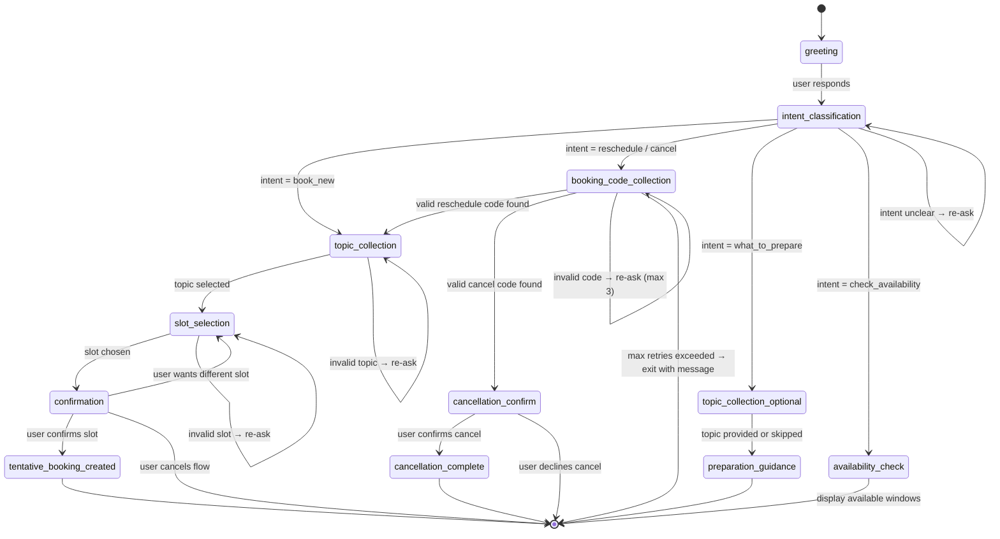
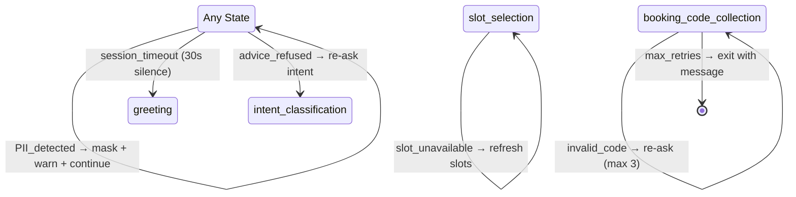

# Voice Agent Architecture — Chat + Voice Advisor Scheduler (Module D)

> Resolves: ADR-004 (Voice provider), ADR-009 (LLM model-per-task — Scheduler portion: Gemini 2.5 Flash-Lite for classification, Gemini 2.5 Flash for generation)
> Depends on: architecture.md Section 4 (Module D), themeClassification.md Section 8 (Theme Handoff), ADR-008 (FastMCP for Calendar/Sheets/Gmail)
> Cost target: **$0** — every component must be free tier, fully local, or explicitly flagged as credit-limited.
> Note: Gemini 2.0 Flash is retired as of March 3, 2026.

---

## 1. Voice Stack Selection

### 1.1 STT (Speech-to-Text) Evaluation

| Criterion | Web Speech API | Deepgram (Free Credits) |
|---|---|---|
| Cost | **$0** (browser-native) | **$0 while credits remain** ($200 signup credits; credit-limited) |
| Browser support | Chrome, Edge only. No Firefox/Safari. | All browsers (server-side processing) |
| Server-side processing | No — runs entirely in browser | Yes — audio sent to Deepgram API |
| Streaming support | Yes (interim results) | Yes (WebSocket streaming) |
| Accuracy (Indian English) | Moderate — inconsistent with accents | High — trained on diverse English accents |
| Noise handling | Poor — degrades in noisy environments | Good — noise-robust models |
| Confidence scores | No | Yes (per-word confidence) |
| Punctuation | Basic | Automatic punctuation + formatting |
| Custom vocabulary | No | Yes (keyword boosting for "ELSS," "SIP," "nominee") |
| Offline capability | No (requires Google servers) | No (requires Deepgram servers) |
| PII detection in transcript | Must build custom regex post-hoc | Must build custom regex post-hoc (same) |
| Latency | ~200–500 ms (varies by browser) | ~100–300 ms (WebSocket streaming) |
| Rate limits | None (browser-throttled) | Free credits: ~45 hrs of audio |
| Reliability for demo | Risky — browser-dependent, no error recovery | Reliable — consistent API behavior |

### 1.2 TTS (Text-to-Speech) Evaluation

| Criterion | Browser SpeechSynthesis | Deepgram TTS |
|---|---|---|
| Cost | **$0** (browser-native) | Consumes from $200 signup credits |
| Voice quality | Robotic on most OS/browser combos | Natural, studio-quality voices |
| Voice consistency | Varies by OS (macOS vs Windows vs Linux) | Consistent across all clients |
| Streaming support | No — must wait for full utterance | Yes — real-time audio streaming |
| SSML support | Partial (browser-dependent) | Yes |
| Latency | ~50–100 ms (local) | ~150–300 ms (API round-trip) |
| IST date/time reading | Poor — reads "16:00" as "sixteen hundred" | Configurable — reads as "4 PM" |
| Booking code reading | Poor — reads "NL-A742" as one word | Configurable — spells out characters |
| Reliability for demo | Acceptable for basic output | Better for polished demo |

### 1.3 Recommendation

| Component | Selected | Justification |
|---|---|---|
| **STT** | **Deepgram** (credit-limited free credits) | Cross-browser consistency, confidence scores for low-confidence retry logic (edgeCase.md), keyword boosting for financial terms. $200 credits cover ~45 hours — far more than needed for capstone development + demo, but this must be flagged as credit-limited. |
| **TTS** | **Deepgram Aura** (credit-limited free credits, ADR-004a) | Natural voice quality, consistent across all clients (server-side), configurable pronunciation for booking codes and IST times. Combined STT+TTS credit usage remains well within $200 pool. Replaces Browser SpeechSynthesis which read codes/times incorrectly. |
| **Fallback STT** | **Web Speech API** | If Deepgram credits are exhausted or API is unreachable, fall back to Web Speech API in Chrome/Edge. Degrade gracefully with a banner: "Voice quality may vary in this browser." |
| **Fallback TTS** | **Browser SpeechSynthesis** (free, ADR-004a) | If Deepgram credits are exhausted, fall back to Browser SpeechSynthesis ($0). Voice format pipeline still improves output quality. |

### 1.4 Audio Pipeline Design (HTTP Batch — ADR-024)

> **Note:** The original design specified WebSocket streaming. ADR-024 changed this to HTTP batch because Vercel serverless functions do not support persistent WebSocket connections. See ADR-024 in decisions.md for full rationale.

```
┌─────────────────────────────────────────────────────────────────┐
│                        Browser Client                           │
│                                                                 │
│  ┌──────────┐   hold-to-talk  ┌───────────────┐               │
│  │ getUserMedia ──────────────▶ MediaRecorder  │               │
│  │ (mic)     │                │ (webm/opus)   │               │
│  └──────────┘                 └──────┬────────┘               │
│                                      │ complete audio blob     │
│  ┌───────────────────────────────────▼──────────────────┐      │
│  │              HTTP POST                                │      │
│  │  /api/scheduler/voice-turn                            │      │
│  │  Body: multipart/form-data { audio, context }         │      │
│  │  ▼ receives: { transcript, response, audio_base64 }   │      │
│  └──┬────────────────────────────────────────────────────┘      │
│     │                                                           │
│  ┌──▼──────────────┐                                           │
│  │ AudioContext     │  ◄── Decode + play base64 audio          │
│  │ (playback)      │      (Deepgram Aura TTS output)           │
│  └─────────────────┘                                           │
└─────────────────────────────────────────────────────────────────┘
          │ HTTP POST (audio up, JSON + base64 audio down)
          ▼
┌─────────────────────────────────────────────────────────────────┐
│              Next.js API Route (maxDuration: 30s)               │
│                /api/scheduler/voice-turn                         │
│                                                                 │
│  ┌──────────────┐    audio    ┌───────────────┐                │
│  │ Route Handler ├───────────▶│ Deepgram REST │                │
│  │              │◀────────────┤ (STT: nova-2) │                │
│  │              │  transcript │               │                │
│  └──────┬───────┘             └───────────────┘                │
│         │ final transcript                                      │
│  ┌──────▼───────┐                                              │
│  │ PII Filter   │  ← regex masking (Section 5)                 │
│  └──────┬───────┘                                              │
│         │ clean transcript                                      │
│  ┌──────▼───────┐                                              │
│  │ State Machine│  ← shared with chat (Section 2)              │
│  └──────┬───────┘                                              │
│         │ response text                                         │
│  ┌──────▼───────┐                                              │
│  │ Voice Format │  ← formatForVoice + buildTtsText             │
│  └──────┬───────┘                                              │
│         │ voice-friendly text                                   │
│  ┌──────▼───────┐    text     ┌───────────────┐                │
│  │ Route Handler ├───────────▶│ Deepgram REST │                │
│  │              │◀────────────┤ (TTS: Aura)   │                │
│  │              │  audio bytes│               │                │
│  └──────┬───────┘             └───────────────┘                │
│         │                                                       │
│  ┌──────▼───────┐                                              │
│  │ Response     │──▶ JSON { transcript, response,              │
│  │              │        audio_base64, context }                │
│  └──────────────┘                                              │
└─────────────────────────────────────────────────────────────────┘
```

**Audio pipeline details:**

| Parameter | Value | Reason |
|---|---|---|
| Client recording | MediaRecorder (webm/opus) | Browser-native, no AudioWorklet needed |
| UX pattern | Hold-to-talk | Required for batch — no interim transcripts |
| Deepgram STT model | `nova-2` | Best accuracy on general English, free tier eligible |
| Deepgram STT options | `{ smart_format: true, punctuate: true, keywords: ["ELSS:2", "SIP:2", "nominee:2", "KYC:2"] }` | Financial term boosting |
| Deepgram TTS model | `aura-asteria-en` | Natural voice, consistent across clients (ADR-004a) |
| Server timeout | 30s (`maxDuration`) | Covers STT (~1s) + engine (~0.1s) + TTS (~0.5s) with margin |
| Typical round-trip | ~1-2s | Audio upload + STT + engine + TTS + response |

**Fallback activation (Web Speech API):**

```typescript
function selectSTTProvider(): "deepgram" | "web_speech_api" {
  if (deepgramCreditsExhausted || !deepgramApiReachable) {
    return "web_speech_api";
  }
  return "deepgram";
}
```

When fallback activates, audio stays in the browser — no server request is made for STT. The browser's `SpeechRecognition` API returns transcript text directly, which is sent to the state machine via a regular HTTP POST to `/api/scheduler/message`. TTS falls back to Browser SpeechSynthesis (ADR-004a).

---

## 2. Shared State Machine (Chat + Voice)

### 2.1 Design Principle

Chat and voice are **input/output modes**, not separate booking systems. Both feed text into the same state machine and receive text responses. The state machine does not know or care whether the input came from a keyboard or a microphone.

```typescript
interface SchedulerInput {
  text: string;
  input_mode: "chat" | "voice";
  session_id: string;
  current_state: SchedulerState;
}

interface SchedulerOutput {
  response_text: string;
  next_state: SchedulerState;
  booking_code?: string;
  slots_offered?: SlotOption[];
  secure_link?: string;
  input_mode: "chat" | "voice";
}
```

The `input_mode` field is recorded in the `bookings` table for analytics but does not affect business logic.

### 2.2 State Diagram



### 2.3 State Definitions

| State | Purpose | LLM Call? | Next States |
|---|---|---|---|
| `greeting` | Welcome + disclaimer + top themes from DB | No (template + DB read) | `intent_classification` |
| `intent_classification` | Classify user intent into one of 5 categories | **Yes** (1 call, Flash-Lite) | `topic_collection`, `booking_code_collection`, `topic_collection_optional`, `availability_check`, or self (re-ask) |
| `topic_collection` | Collect consultation topic (book/reschedule only) | No (menu selection) | `slot_selection` |
| `topic_collection_optional` | Optionally collect topic (what-to-prepare) | No (menu selection) | `preparation_guidance` |
| `booking_code_collection` | Ask for existing booking code (cancel/reschedule) | No (validation only) | `topic_collection`, `cancellation_confirm`, or self (re-ask) |
| `slot_selection` | Show available slots, collect preference | No (calendar read) | `confirmation` or self (re-ask) |
| `confirmation` | Read back date/time in IST, ask user to confirm | No (template) | `tentative_booking_created`, `slot_selection`, or exit |
| `tentative_booking_created` | Generate or reuse booking code, create/update records, deliver tentative code | No (template + DB/MCP writes) | terminal |
| `cancellation_complete` | Complete cancellation or submit post-confirmation cancellation request | No (template + DB/MCP writes) | terminal |
| `availability_check` | Show available time windows | No (calendar read) | terminal |
| `preparation_guidance` | Provide preparation tips for selected topic | **Yes** (1 call, Flash) | terminal |
| `cancellation_confirm` | Confirm cancellation of existing booking | No (template) | `cancellation_complete` or exit |

### 2.4 State Machine Implementation

```typescript
type SchedulerState =
  | "greeting"
  | "intent_classification"
  | "topic_collection"
  | "topic_collection_optional"
  | "booking_code_collection"
  | "slot_selection"
  | "confirmation"
  | "tentative_booking_created"
  | "cancellation_complete"
  | "availability_check"
  | "preparation_guidance"
  | "cancellation_confirm";

interface SessionContext {
  session_id: string;
  state: SchedulerState;
  input_mode: "chat" | "voice";
  intent?: Intent;
  topic?: string;
  booking_code?: string;
  selected_slot?: SlotOption;
  slots_offered?: SlotOption[];
  retry_count: number;
  max_retries: 3;
}

async function processMessage(
  input: SchedulerInput,
  context: SessionContext
): Promise<SchedulerOutput> {
  switch (context.state) {
    case "greeting":
      return handleGreeting(context);
    case "intent_classification":
      return handleIntentClassification(input, context);
    case "topic_collection":
      return handleTopicCollection(input, context);
    case "topic_collection_optional":
      return handleTopicCollectionOptional(input, context);
    case "booking_code_collection":
      return handleBookingCodeCollection(input, context);
    case "slot_selection":
      return handleSlotSelection(input, context);
    case "confirmation":
      return handleConfirmation(input, context);
    case "cancellation_confirm":
      return handleCancellationConfirm(input, context);
    case "availability_check":
      return handleAvailabilityCheck(context);
    case "preparation_guidance":
      return handlePreparationGuidance(input, context);
    case "tentative_booking_created":
      return handleTentativeBookingCreated(context);
    case "cancellation_complete":
      return handleCancellationComplete(context);
  }
}
```

---

## 3. Intent Classification and Routing

### 3.1 Supported Intents

| # | Intent | Description | Requires Topic? | Requires Booking Code? |
|---|---|---|---|---|
| 1 | `book_new` | Book a new advisor appointment | Yes | No |
| 2 | `reschedule` | Change an existing appointment's slot | Yes | Yes |
| 3 | `cancel` | Cancel an existing appointment | No | Yes |
| 4 | `what_to_prepare` | Get preparation guidance before a call | Optional | No |
| 5 | `check_availability` | View available time windows | No | No |

### 3.2 Intent Routing Table

| Intent | Route After Classification |
|---|---|
| `book_new` | `greeting` → `intent_classification` → `topic_collection` → `slot_selection` → `confirmation` → `tentative_booking_created` |
| `reschedule` | `greeting` → `intent_classification` → `booking_code_collection` → `topic_collection` → `slot_selection` → `confirmation` → `tentative_booking_created` or Admin-gated reschedule request |
| `cancel` | `greeting` → `intent_classification` → `booking_code_collection` → `cancellation_confirm` → `cancellation_complete` |
| `what_to_prepare` | `greeting` → `intent_classification` → `topic_collection_optional` → `preparation_guidance` |
| `check_availability` | `greeting` → `intent_classification` → `availability_check` |

### 3.3 Intent Classification Prompt

```
You are an intent classifier for the Groww advisor scheduler.

Classify the user's message into exactly ONE of these intents:
- book_new: User wants to book a new advisor appointment
- reschedule: User wants to change an existing appointment
- cancel: User wants to cancel an existing appointment
- what_to_prepare: User wants to know what to prepare before a call
- check_availability: User wants to see available time windows

User message: "{user_message}"

Return JSON:
{
  "intent": "book_new",
  "confidence": 0.92
}

If confidence < 0.6, return:
{
  "intent": "unclear",
  "confidence": 0.3
}
```

**Model:** Gemini 2.5 Flash-Lite (cheapest, fastest — per ADR-009, rules.md)

**Low-confidence handling (per edgeCase.md):** If `confidence < 0.6`, the state machine stays in `intent_classification` and asks the user to clarify:

> "I'm not sure I understood. Would you like to:
> 1. Book a new appointment
> 2. Reschedule an existing appointment
> 3. Cancel an existing appointment
> 4. Know what to prepare
> 5. Check available times"

### 3.4 Supported Topics

For `book_new` and `reschedule` intents, the user selects from:

| # | Topic |
|---|---|
| 1 | KYC / Onboarding |
| 2 | SIP / Mandates |
| 3 | Statements / Tax Docs |
| 4 | Withdrawals & Timelines |
| 5 | Account Changes / Nominee |

Topic collection is a **menu selection, not an LLM call.** The system presents options and matches the user's response by keyword or number.

```typescript
const TOPICS = [
  "KYC / Onboarding",
  "SIP / Mandates",
  "Statements / Tax Docs",
  "Withdrawals & Timelines",
  "Account Changes / Nominee",
] as const;

type Topic = (typeof TOPICS)[number];

function matchTopic(userInput: string): Topic | null {
  const lower = userInput.toLowerCase();
  if (/\b(1|kyc|onboard)/i.test(lower)) return TOPICS[0];
  if (/\b(2|sip|mandate)/i.test(lower)) return TOPICS[1];
  if (/\b(3|statement|tax|doc)/i.test(lower)) return TOPICS[2];
  if (/\b(4|withdraw|timeline)/i.test(lower)) return TOPICS[3];
  if (/\b(5|account|nominee|change)/i.test(lower)) return TOPICS[4];
  return null;
}
```

---

## 4. Theme-Aware Greeting

### 4.1 Theme Source

Themes come from the **database, not the LLM.** The Scheduler reads the `top_customer_themes` field from the latest `review_pulse` record (see themeClassification.md Section 8).

```sql
SELECT top_customer_themes
FROM review_pulse
ORDER BY created_at DESC
LIMIT 1
```

This is a single DB query. Zero LLM calls.

### 4.2 Greeting Template

```typescript
function buildGreeting(themes: string[], inputMode: "chat" | "voice"): string {
  const disclaimer =
    "This is for informational support only, not investment advice.";

  if (themes.length === 0) {
    return (
      `Hi, I can help you book or manage a tentative advisor slot. ` +
      `${disclaimer}\n\n` +
      `What would you like to do?`
    );
  }

  const themeList = themes.slice(0, 3).join(" and ");
  return (
    `Hi, I can help you book or manage a tentative advisor slot. ` +
    `${disclaimer}\n\n` +
    `I also see many users are currently asking about ${themeList}. ` +
    `Is that what you need help with, or is it something else?`
  );
}
```

### 4.3 Theme Greeting Rules

1. Themes are **never forced** — the customer can choose any intent or topic regardless of trending themes.
2. Maximum **3 themes** displayed in greeting (even if the pulse has 5).
3. If no pulse exists (first run, no reviews yet), the greeting omits the theme sentence entirely.
4. The greeting is identical for chat and voice — only the delivery mechanism differs (text bubble vs TTS).
5. The informational-support disclaimer is **always** present.

### 4.4 Voice-Specific Greeting Behavior

For voice mode, the greeting is spoken via Browser SpeechSynthesis immediately when the voice session starts. The user hears the greeting and can respond verbally. The system listens for the response via Deepgram STT.

---

## 5. No-PII in Voice (Regex Detection)

### 5.1 Design

PII detection in voice transcripts uses **regex patterns only, not LLM.** This is deterministic, instant, and free. The same regex utility used for review PII masking (themeClassification.md Section 9) is reused here.

### 5.2 PII Patterns (Voice)

| PII Type | Regex Pattern | Example Caught |
|---|---|---|
| Phone number | `\b(?:\+?91[\s-]?)?[6-9]\d[\d\s-]{7,9}\d\b` | "my number is 9876543210" |
| Email | `\b[\w.-]+@[\w.-]+\.\w+\b` | "email me at john@gmail.com" |
| Obfuscated email | `\b\w+\s*\[at\]\s*\w+\s*\[dot\]\s*\w+` | "john [at] gmail [dot] com" |
| PAN | `\b[A-Z]{5}\d{4}[A-Z]\b` | "my PAN is ABCDE1234F" |
| Aadhaar | `\b[2-9]\d{3}[\s-]*\d{4}[\s-]*\d{4}\b` | "Aadhaar number 2345  6789  0123" |
| Account number | `\b\d{9,18}\b` (in financial context) | "account number 123456789012" |
| Full name | `name is/: First Last` or `I am First Last` | "I am John Doe, what is exit load?" |

### 5.3 Voice PII Pipeline

```
Deepgram STT returns transcript
        ↓
maskPII(transcript) — regex scan
        ↓
IF pii_found:
    ├── Replace PII with [REDACTED] in transcript
    ├── Do NOT repeat PII back in TTS response
    ├── Respond: "I noticed some personal information.
    │   For your security, I've removed it. Please don't
    │   share personal details here — you'll receive a
    │   secure link to submit those after booking."
    └── Continue state machine with masked transcript
ELSE:
    └── Pass clean transcript to state machine
```

### 5.4 Voice-Specific PII Behaviors

| Scenario | Behavior |
|---|---|
| User speaks PAN or phone number | Mask immediately. Do not repeat back. Warn and continue. |
| User speaks email address | Mask. Inform user about secure link. |
| PII appears in booking code context | Booking codes (`LL-LDDD`, e.g. `NL-A742`) do not match PII patterns — no false positive. |
| Deepgram transcribes digits ambiguously | Regex still catches 10-digit sequences; confidence score irrelevant for PII scan. |

### 5.5 PII Filter Interface

```typescript
interface PIIMaskResult {
  masked_text: string;
  pii_found: boolean;
  pii_types_detected: string[];
  replacements_made: number;
}

function maskPII(text: string): PIIMaskResult {
  let masked = text;
  let found = false;
  const types: string[] = [];
  let count = 0;

  const patterns: [RegExp, string][] = [
    [/\b[A-Z]{5}\d{4}[A-Z]\b/g, "PAN"],
    [/\b\d{4}\s?\d{4}\s?\d{4}\b/g, "Aadhaar"],
    [/\+91\s?\d{10}\b/g, "phone"],
    [/\b\d{10}\b/g, "phone"],
    [/\b[\w.-]+@[\w.-]+\.\w+\b/g, "email"],
    [/\b\d{9,18}\b/g, "account_number"],
  ];

  for (const [regex, type] of patterns) {
    const matches = masked.match(regex);
    if (matches) {
      found = true;
      types.push(type);
      count += matches.length;
      masked = masked.replace(regex, "[REDACTED]");
    }
  }

  return { masked_text: masked, pii_found: found, pii_types_detected: types, replacements_made: count };
}
```

---

## 6. IST Confirmation Format

### 6.1 Date/Time Display Rule

All date/time values shown to the customer must be in **IST (Asia/Kolkata, UTC+05:30)**. The confirmation step reads back the full formatted slot.

### 6.2 Format Specification

| Field | Format | Example |
|---|---|---|
| Full slot (chat) | `{DayOfWeek}, {DD} {Month} {YYYY}, {h:mm} {AM/PM} IST` | Monday, 29 April 2026, 4:00 PM IST |
| Full slot (voice TTS) | Same string spoken aloud | "Monday, twenty-nine April twenty twenty-six, four PM IST" |
| Duration | Always 30 minutes | 4:00 PM – 4:30 PM IST |
| Timezone label | Always append "IST" | Required in both chat and voice |

### 6.3 Confirmation Template

**Chat:**

```
Please confirm your booking:
  Topic: Account Changes / Nominee
  Slot: Monday, 29 April 2026, 4:00 PM IST (30 min)

Reply "yes" to confirm or "no" to pick a different slot.
```

**Voice (TTS reads aloud):**

```
"I have a slot for Account Changes / Nominee on Monday, twenty-nine April
twenty twenty-six at four PM IST, for thirty minutes. Shall I confirm this?"
```

### 6.4 Formatter

```typescript
function formatSlotIST(start: Date): string {
  return start.toLocaleDateString("en-IN", {
    weekday: "long",
    day: "numeric",
    month: "long",
    year: "numeric",
    timeZone: "Asia/Kolkata",
  }) + ", " + start.toLocaleTimeString("en-IN", {
    hour: "numeric",
    minute: "2-digit",
    hour12: true,
    timeZone: "Asia/Kolkata",
  }) + " IST";
}
```

---

## 7. Booking Code Delivery

### 7.1 Booking Code Format

Format: `LL-LDDD` — two uppercase letters, a hyphen, one uppercase letter followed by three digits.

Example: `NL-A742`

```typescript
function generateBookingCode(): string {
  const letters = "ABCDEFGHIJKLMNOPQRSTUVWXYZ";
  const prefix = letters[Math.floor(Math.random() * 26)]
               + letters[Math.floor(Math.random() * 26)];
  const suffix = letters[Math.floor(Math.random() * 26)]
               + String(Math.floor(Math.random() * 900) + 100);
  return `${prefix}-${suffix}`;
}
```

### 7.2 Chat Delivery

```
Your tentative booking has been created!

  Booking Code: NL-A742
  Topic: Account Changes / Nominee
  Slot: Monday, 29 April 2026, 4:00 PM IST

Please save your booking code. You'll need it to reschedule or cancel.

To complete your booking, please submit your details through this secure link:
[Secure Details Link]
```

### 7.3 Voice Delivery

For voice, the booking code is **spelled out character by character** to avoid misinterpretation:

```typescript
function spellBookingCode(code: string): string {
  return code.split("").map(char => {
    if (char === "-") return "dash";
    if (/\d/.test(char)) return char;
    return char.toUpperCase();
  }).join(", ");
}

// "NL-A742" → "N, L, dash, A, 7, 4, 2"
```

**Voice TTS output:**

> "Your tentative booking has been created. Your booking code is: N, L, dash, A, 7, 4, 2. I'll repeat that: N, L, dash, A, 7, 4, 2. Please save this code — you'll need it to reschedule or cancel. You'll also receive a secure link to submit your personal details. Final confirmation happens after Admin approval."

### 7.4 Booking Code Persistence

Per rules.md Booking Rules, the booking code appears in:

| Artifact | Field | Example |
|---|---|---|
| Customer tentative booking response | Response text | `Booking Code: NL-A742` |
| Advisor calendar hold title | Calendar event title | `Advisor Q&A — Account Changes / Nominee — NL-A742` |
| Google Sheet row | `booking_code` column | `NL-A742` |
| Advisor email draft subject | Email subject | `Advisor Pre-Booking — Account Changes / Nominee — NL-A742` |
| HITL Approval Center | `booking_code` field in `hitl_actions` | `NL-A742` |
| App DB `bookings` table | `booking_code` column | `NL-A742` |

---

## 8. Error Handling

### 8.1 Voice-Specific Errors

> **Updated per ADR-024:** Voice uses HTTP batch transport, not WebSocket. Error patterns reflect the batch model.

| Error | Detection | Response | Recovery |
|---|---|---|---|
| **Deepgram STT API unreachable** | `/voice-turn` returns `{ error: "stt_unavailable" }` | Client shows banner: "Using browser voice — quality may vary." | Fall back to Web Speech API (browser-side STT) + Browser SpeechSynthesis (local TTS). Voice input sent as text via `POST /api/scheduler/message`. |
| **Deepgram STT returns empty transcript** | Deepgram REST response has empty/null transcript | "I didn't catch that. Could you hold the mic button and try again?" | Stay in current state. Retry count incremented. After 3 failures, suggest switching to chat. |
| **Low confidence transcription** | Deepgram `confidence < 0.5` on result | "I didn't quite catch that. Could you please repeat?" | Stay in current state. Retry count incremented. After 3 low-confidence retries, suggest switching to chat: "For a smoother experience, you can also type your response in the chat." |
| **Deepgram TTS fails** | TTS API error in `/voice-turn` | Return JSON response without `audio_base64`. Client displays text response and falls back to Browser SpeechSynthesis for this turn. | Non-blocking — text response is always available. |
| **Deepgram credits exhausted** | STT or TTS returns 402/quota error | Client switches to Web Speech API + Browser SpeechSynthesis permanently for the session. Admin dashboard shows warning. | Per ADR-004 and ADR-004a fallback strategy. |
| **Voice-turn timeout** | `/voice-turn` exceeds 30s `maxDuration` | Client shows error: "That took too long. Please try again or type your response." | Retry once. If still timing out, suggest chat. |
| **Booking code spoken unclearly** | Code validation fails against DB | "I couldn't find that booking code. Could you spell it out letter by letter?" | Read back what was heard: "I heard [X]. Is that correct?" (per edgeCase.md) |
| **Microphone permission denied** | `getUserMedia` throws `NotAllowedError` | "I need microphone access to use voice. Please allow microphone access in your browser settings, or you can use the chat instead." | Offer chat fallback. Do not retry permission request. |
| **Browser unsupported (fallback STT)** | `window.SpeechRecognition` undefined + Deepgram unavailable | "Voice is not supported in this browser. Please use Chrome or Edge, or use the chat instead." | Redirect to chat interface. |
| **LLM fallback timeout** | Gemini call exceeds 5s timeout (ADR-025) | "I didn't quite understand. Could you rephrase?" | Treated as regex miss — ask user to clarify. No retry of LLM call. |

### 8.2 Shared Errors (Chat + Voice)

| Error | Detection | Response | Recovery |
|---|---|---|---|
| **LLM API rate limit** | HTTP 429 from Gemini API | "I'm experiencing a brief delay. Please wait a moment." | Exponential backoff: 2s → 4s → 8s. Max 3 retries. (per edgeCase.md) |
| **LLM malformed response** | JSON parse failure on intent classification | Retry once with same input. If still malformed, ask user to clarify. | (per edgeCase.md) |
| **Slot becomes unavailable** | Calendar API returns conflict on confirmation | "Sorry, that slot was just taken. Let me show you other available times." | Return to `slot_selection` with refreshed availability. (per edgeCase.md) |
| **Calendar/Sheet/Gmail MCP failure** | MCP adapter throws on post-booking writes | Booking saved in DB with `calendar_status: "failed"` / `sheet_status: "failed"` / `email_draft_status: "failed"`. Customer still receives booking code. | Surface partial failure in HITL Center. Admin can retry. (per edgeCase.md) |
| **Wrong booking code (cancel/reschedule)** | DB lookup returns no match | "I couldn't find a booking with that code. Please check and try again." | Allow 3 retries, then exit with help message. (per edgeCase.md) |
| **Cancel already-cancelled booking** | Booking record has `status: "cancelled"` | "This booking has already been cancelled. No further action is needed." | Exit flow. (per edgeCase.md) |
| **PII detected in input** | Regex match in `maskPII()` | PII warning message (Section 5.3). Masked text continues through pipeline. | Do not block flow. Mask and continue. |
| **Investment advice request** | Intent classifier returns advice-related intent | Standard refusal message from rules.md. | Stay in `intent_classification`. Ask user for a supported intent. |

### 8.3 Error State Transitions



---

## 9. LLM Calls Per Booking Conversation

> **Updated per ADR-025:** The current implementation uses deterministic regex for intent classification and day resolution (0 LLM calls in the typical case). LLM calls are a structured-output fallback via Gemini 2.5 Flash-Lite, firing only when regex returns null/unclear. Feature-flagged via `SCHEDULER_LLM_FALLBACK=true`. Implemented in `src/services/scheduler/llm-fallback.ts` (intent, confidence >= 0.6 threshold) and `llm-day-resolution.ts` (date parsing). Both have 5s timeouts and return null on failure, so the deterministic path is always the safe default.

### 9.1 Deterministic-First Strategy (ADR-025)

```
User input → regex parser (intent or day)
    ├── match found → use it (0 LLM calls)
    └── no match → Gemini Flash-Lite fallback (1 LLM call, ~80 tokens)
        ├── valid result → use it
        └── null/timeout → ask user to clarify (same as regex miss)
```

Two fallback points exist:
1. **Intent classification** — when `classifySchedulerIntent()` returns `"unclear"`
2. **Day resolution** — when `resolveDayPreference()` returns `null`

### 9.2 Call Breakdown by Intent

**Intent: `book_new` (most common path)**

| State | Regex succeeds | Regex fails (LLM fallback) | Model | Tokens (est.) |
|---|---|---|---|---|
| `greeting` | No LLM | No LLM | — | 0 |
| `intent_classification` | No LLM (regex match) | **1 call** (fallback) | Gemini 2.5 Flash-Lite | 0 or ~80 |
| `topic_collection` | No LLM | No LLM | — | 0 |
| `time_collection` | No LLM (regex match) | **1 call** (fallback) | Gemini 2.5 Flash-Lite | 0 or ~80 |
| `slot_selection` | No LLM | No LLM | — | 0 |
| `confirmation` | No LLM | No LLM | — | 0 |
| **Typical total** | **0 LLM calls** | | | **0 tokens** |
| **Worst-case total** | **2 LLM calls** | | | **~160 tokens** |

**Intent: `reschedule`**

| Scenario | LLM Calls | Tokens |
|---|---|---|
| Typical (regex matches intent + day) | **0** | 0 |
| Worst case (both regex fail) | **2** | ~160 |

**Intent: `cancel`**

| Scenario | LLM Calls | Tokens |
|---|---|---|
| Typical | **0** | 0 |
| Worst case (intent regex fails) | **1** | ~80 |

**Intent: `what_to_prepare`**

| Scenario | LLM Calls | Tokens |
|---|---|---|
| Typical (regex matches intent) | **1** (preparation guidance generation) | ~200 |
| Worst case (intent regex fails) | **2** (fallback + guidance) | ~280 |

**Intent: `check_availability`**

| Scenario | LLM Calls | Tokens |
|---|---|---|
| Typical | **0** | 0 |
| Worst case (intent regex fails) | **1** | ~80 |

### 9.3 Summary Table

| Intent | Typical LLM Calls | Worst-Case LLM Calls | Typical Tokens | Worst-Case Tokens | Notes |
|---|---|---|---|---|---|
| `book_new` | **0** | **2** | 0 | ~160 | Regex handles "book a call" + "tomorrow" |
| `reschedule` | **0** | **2** | 0 | ~160 | Regex handles "reschedule" + "Monday" |
| `cancel` | **0** | **1** | 0 | ~80 | No day resolution needed |
| `what_to_prepare` | **1** | **2** | ~200 | ~280 | Guidance generation always uses Flash |
| `check_availability` | **0** | **1** | 0 | ~80 | No day resolution needed |

### 9.4 Retry Overhead

| Scenario | Additional LLM Calls | When |
|---|---|---|
| LLM fallback returns "unclear" (confidence < 0.6) | 0 (ask user to clarify, no retry) | Ambiguous message even for LLM |
| LLM returns malformed JSON | 0 (treated as null, ask user to clarify) | JSON parse error |
| LLM times out (5s) | 0 (treated as null, ask user to clarify) | API latency spike |
| Advice request refused | 0 | Refusal is template-based, no LLM call |
| Feature flag off (`SCHEDULER_LLM_FALLBACK_ENABLED=false`) | 0 always | All LLM fallback disabled |

**Worst case for `book_new` with 2 intent retries:** 3 LLM calls, ~240 tokens.

**Typical case:** 1 LLM call, ~80 tokens.

### 9.4 Cost Impact

At 1–2 LLM calls per booking conversation using Gemini 2.5 Flash-Lite (15 RPM, 1,000 RPD) for classification and Gemini 2.5 Flash (10 RPM, 500 RPD) for generation:

- **Capacity:** Classification calls use Flash-Lite's 1,000 RPD budget. Generation calls (what_to_prepare only) use Flash's 500 RPD budget.
- **Daily capacity:** Hundreds of booking conversations per day — far beyond capstone demo needs.
- **Cost:** $0.

---

## 10. Prompt Templates

### 10.1 Intent Classification Prompt

```
You are an intent classifier for the Groww advisor scheduling system.

The user has sent a message during a booking conversation.
Classify the message into exactly ONE of these intents:

- book_new: User wants to schedule a new advisor appointment
- reschedule: User wants to change the time of an existing appointment
- cancel: User wants to cancel an existing appointment
- what_to_prepare: User wants to know what documents or info to have ready before a call
- check_availability: User wants to see when advisors are available

User message: "{user_message}"

Respond with JSON only, no explanation:
{
  "intent": "<one of: book_new, reschedule, cancel, what_to_prepare, check_availability, unclear>",
  "confidence": <float 0.0 to 1.0>
}

Rules:
- If the message mentions "book", "schedule", "appointment", "new slot" → book_new
- If the message mentions "change", "move", "reschedule", "different time" → reschedule
- If the message mentions "cancel", "remove", "delete", "don't want" → cancel
- If the message mentions "prepare", "bring", "documents", "ready", "before the call" → what_to_prepare
- If the message mentions "available", "free", "when", "times", "slots" → check_availability
- If you cannot confidently classify, return intent "unclear" with low confidence
```

### 10.2 Preparation Guidance Prompt

```
You are a helpful assistant for Groww advisor appointments.

The user has a {topic} consultation scheduled. Provide 3-5 concise
preparation tips — what they should have ready or review before the call.

Topic: {topic}

Rules:
- Do NOT provide investment advice, return predictions, or fund recommendations
- Do NOT ask for PII (PAN, Aadhaar, phone, email, account number)
- Keep each tip to one sentence
- Focus on documents, questions to think about, and app sections to review
- Mention the secure details link for submitting personal information

Return JSON:
{
  "tips": [
    "Review your current SIP setup in the Groww app before the call.",
    "List any specific questions about mandate failures or payment issues.",
    "Personal details can be submitted through the secure link after booking."
  ]
}
```

### 10.3 Greeting Template (Not a Prompt — No LLM)

```typescript
const GREETING_TEMPLATE = {
  with_themes: `Hi, I can help you book or manage a tentative advisor slot. ` +
    `This is for informational support only, not investment advice.\n\n` +
    `I also see many users are currently asking about {themes}. ` +
    `Is that what you need help with, or is it something else?`,

  without_themes: `Hi, I can help you book or manage a tentative advisor slot. ` +
    `This is for informational support only, not investment advice.\n\n` +
    `What would you like to do?`,
};
```

### 10.4 Confirmation Template (Not a Prompt — No LLM)

```typescript
const CONFIRMATION_TEMPLATE =
  `Please confirm your booking:\n` +
  `  Topic: {topic}\n` +
  `  Slot: {formatted_slot_ist}\n\n` +
  `Reply "yes" to confirm or "no" to pick a different slot.`;
```

### 10.5 Tentative Booking Created Template (Not a Prompt — No LLM)

```typescript
const TENTATIVE_BOOKING_CREATED_TEMPLATE =
  `Your tentative booking has been created!\n\n` +
  `  Booking Code: {booking_code}\n` +
  `  Topic: {topic}\n` +
  `  Slot: {formatted_slot_ist}\n\n` +
  `Please save your booking code. You'll need it to reschedule or cancel.\n\n` +
  `To complete your booking, please submit your details through this secure link:\n` +
  `{secure_link}\n\n` +
  `Final confirmation happens after Admin approval.`;
```

### 10.6 PII Warning Template (Not a Prompt — No LLM)

```typescript
const PII_WARNING_TEMPLATE =
  `I noticed some personal information in your message. ` +
  `For your security, I've removed it. ` +
  `Please don't share personal details here — ` +
  `you'll receive a secure link to submit those after booking.`;
```

### 10.7 Refusal Template (Not a Prompt — No LLM, from rules.md)

```typescript
const ADVICE_REFUSAL =
  `I can't provide investment advice, future return predictions, or handle ` +
  `personal account information. I can help with facts from approved ` +
  `sources, such as NAV, AUM, exit load, expense ratio, lock-in, benchmark, ` +
  `riskometer, historic returns, fund manager, rating, fee explanation, ` +
  `or statement download steps. ` +
  `For investor education, see https://investor.sebi.gov.in/.`;
```

---

## 11. Full Conversation Flow (Book New — Voice)

Example walkthrough of a complete voice booking:

```
[System] (TTS): "Hi, I can help you book or manage a tentative advisor
  slot. This is for informational support only, not investment advice.
  I also see many users are currently asking about Nominee Updates and
  Login Issues. Is that what you need help with, or is it something else?"

  State: greeting → intent_classification
  LLM calls so far: 0

[User] (STT): "I'd like to book a call about my nominee issue"

  PII check: clean
  → Send to intent classifier (LLM call #1)
  → Result: { intent: "book_new", confidence: 0.94 }

  State: intent_classification → topic_collection
  LLM calls so far: 1

[System] (TTS): "Got it. Which topic best describes your question?
  1. KYC / Onboarding
  2. SIP / Mandates
  3. Statements / Tax Docs
  4. Withdrawals & Timelines
  5. Account Changes / Nominee"

[User] (STT): "Number 5, nominee"

  PII check: clean
  → matchTopic("Number 5, nominee") → "Account Changes / Nominee"

  State: topic_collection → slot_selection
  LLM calls so far: 1

[System] (TTS): "Here are available slots:
  1. Monday, 29 April 2026, 4:00 PM IST
  2. Tuesday, 30 April 2026, 11:00 AM IST
  3. Wednesday, 1 May 2026, 2:00 PM IST
  Which slot works for you?"

[User] (STT): "The first one, Monday"

  PII check: clean
  → matchSlot("The first one, Monday") → slot 1

  State: slot_selection → confirmation
  LLM calls so far: 1

[System] (TTS): "I have a slot for Account Changes / Nominee on Monday,
  twenty-nine April twenty twenty-six at four PM IST, for thirty minutes.
  Shall I confirm this?"

[User] (STT): "Yes, confirm"

  State: confirmation → tentative_booking_created
  LLM calls so far: 1

  → generateBookingCode() → "NL-A742"
  → DB: insert booking record
  → MCP: create advisor calendar hold
  → MCP: create Google Sheet row
  → MCP: create template advisor email draft
  → DB: create HITL record

[System] (TTS): "Your tentative booking has been created. Your booking code is:
  N, L, dash, A, 7, 4, 2. I'll repeat that: N, L, dash, A, 7, 4, 2.
  Please save this code — you'll need it to reschedule or cancel.
  You'll also receive a secure link to submit your personal details.
  Final confirmation happens after Admin approval."

  State: tentative_booking_created → [end]
  Total LLM calls: 1
  Total tokens: ~80
```

---

## 12. Voice UI Considerations

### 12.1 Visual Feedback During Voice

| State | Visual Indicator |
|---|---|
| Listening | Pulsing microphone icon |
| Processing (STT → state machine) | Spinning indicator |
| Speaking (TTS) | Sound wave animation |
| Idle / waiting for user | Static microphone icon |
| Error | Red microphone icon with message |
| Fallback mode (Web Speech API) | Banner: "Using browser voice — quality may vary" |

### 12.2 Voice/Chat Toggle

The user can switch between chat and voice mid-conversation. The session context persists — switching mode does not reset the state machine.

```typescript
interface ModeSwitch {
  session_id: string;
  from_mode: "chat" | "voice";
  to_mode: "chat" | "voice";
  current_state: SchedulerState;
  context_preserved: true;
}
```

### 12.3 Accessibility

- Voice mode requires explicit opt-in (user clicks microphone button).
- Chat is always available as the default and fallback.
- TTS can be muted without affecting STT.
- All voice responses are simultaneously displayed as text in the chat panel.

---

## 13. File Structure

> **Updated to reflect actual implementation file names and ADR-024 (HTTP batch voice).**

```
src/services/
├── scheduler/
│   ├── state-machine.ts       # Shared state machine (chat + voice)
│   ├── topics.ts              # Regex intent classification + topic matching + STT phonetics
│   ├── time-preference.ts     # Day/time parsing + day resolution
│   ├── format.ts              # IST date/time formatting
│   ├── booking-code.ts        # Booking code generation (LL-LDDD)
│   ├── booking-lifecycle.ts   # Booking creation, reschedule, cancel orchestration
│   ├── greeting.ts            # Theme-aware greeting builder
│   ├── voice-format.ts        # formatForVoice() + buildTtsText() for voice output
│   ├── llm-fallback.ts        # Gemini structured output fallback (ADR-025)
│   ├── llm-day-resolution.ts  # Gemini day resolution fallback (ADR-025)
│   ├── types.ts               # All scheduler types and interfaces
│   └── server.ts              # Dependency injection factory

src/services/safety/
├── pii.ts                     # Regex PII masking (shared with Module A + voice)

src/adapters/
├── deepgram/
│   └── index.ts               # Deepgram HTTP adapter: STT (nova-2) + TTS (Aura)

app/api/scheduler/
├── message/
│   └── route.ts               # HTTP POST endpoint for chat messages
├── voice-turn/
│   └── route.ts               # HTTP POST endpoint for voice (ADR-024)

src/ui/
├── UnifiedCustomerAssistantClient.tsx  # Unified chat + voice UI
```

---

## 14. Cost Summary

| Component | Service | Cost |
|---|---|---|
| STT (primary) | Deepgram nova-2 (credit-limited $200 signup credits) | **$0 while credits remain** |
| STT (fallback) | Web Speech API (browser-native) | **$0** |
| TTS (primary) | Deepgram Aura (credit-limited $200 signup credits, ADR-004a) | **$0 while credits remain** |
| TTS (fallback) | Browser SpeechSynthesis (native, ADR-004a) | **$0** |
| Intent classification | Regex (deterministic, 0 calls typical) | **$0** |
| Intent fallback | Gemini 2.5 Flash-Lite (ADR-025, only on regex miss) | **$0** |
| Day resolution fallback | Gemini 2.5 Flash-Lite (ADR-025, only on regex miss) | **$0** |
| Preparation guidance | Gemini 2.5 Flash (free tier) — 1 call (what_to_prepare only) | **$0** |
| Theme read | DB query (no API) | **$0** |
| Topic matching | Regex/keyword (local) | **$0** |
| PII masking | Regex (local) | **$0** |
| Slot formatting | `Intl.DateTimeFormat` (local) | **$0** |
| Voice formatting | Local text pipeline (no API) | **$0** |
| **Total per booking** | **0-2 Flash-Lite fallback calls + optional 1 Flash call + Deepgram STT+TTS session** | **$0 for capstone/demo while credits remain** |

No component in this architecture costs money for the capstone demo. Deepgram STT+TTS share the $200 credit pool and fall back to Web Speech API + Browser SpeechSynthesis when unavailable or exhausted. LLM fallback calls are feature-flagged and fire only on regex misses (typical: 0 calls).
